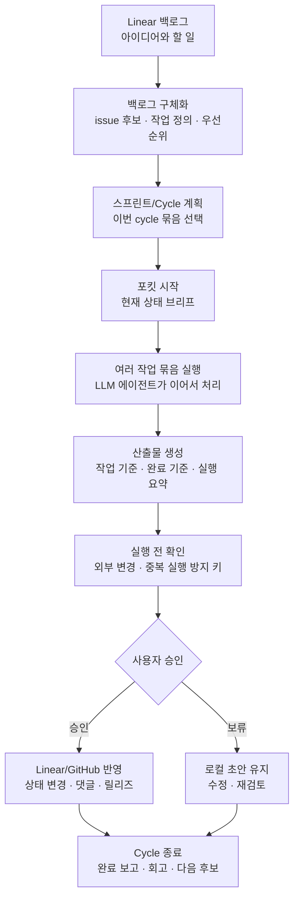
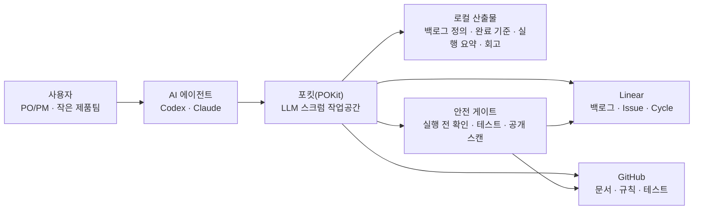

# 포킷(POKit)

포킷은 사람과 LLM이 함께 백로그를 만들고, 스프린트를 돌리고, 회고까지 이어가는 LLM 스크럼 운영 서비스입니다.

포킷은 복잡한 관리 도구가 아니라, 사람과 LLM이 함께 스크럼을 굴리게 해주는 가벼운 작업공간입니다.

기존 AI Scrum Master 도구가 Jira/Slack 중심의 팀 운영 자동화에 가깝다면, 포킷은 Linear와 GitHub repo 위에서 개인 PO/PM과 1인 메이커가 LLM 에이전트와 함께 일하는 스크럼 작업공간을 지향합니다.

사용자는 매번 작업을 쪼개고 확인하느라 시간을 쓰는 대신, 중요한 제품 판단과 승인에 집중할 수 있습니다.

## 누구를 위한 서비스인가

- 혼자 제품을 만들거나 운영하면서 백로그, 스프린트/cycle, 회고 흐름을 꾸준히 유지하고 싶은 사람.
- Linear로 백로그와 스프린트/cycle을 운영하는 개인 PO/PM.
- 여러 작업을 한 번에 맡기고, 업무 시간과 업무 이후 시간에도 LLM 에이전트가 계속 진행해 주길 원하는 사람.
- 작은 팀에서 Linear와 GitHub를 이미 쓰고 있고, AI 에이전트를 작업 파트너로 붙여보고 싶은 팀.
- Codex나 Claude 같은 AI 에이전트에게 일을 맡기되, Linear/GitHub 변경은 안전하게 통제하고 싶은 사용자.

## 무엇을 해주는가

포킷은 Linear issue와 cycle을 읽고, LLM 에이전트가 스크럼을 굴리는 데 필요한 기능을 제공합니다.

- 세션 브리핑: 현재 cycle의 Todo, 진행 중, 완료 상태와 다음 실행 문장을 보여줍니다.
- 스크럼 맥락 유지: 이전 세션의 결정, 남은 일, 승인 대기, 다음 액션을 이어서 볼 수 있게 남깁니다.
- 백로그 구체화: 아이디어를 실행 가능한 issue 후보, 작업 정의, 우선순위로 나눕니다.
- 스프린트/Cycle 계획: 이번 cycle에 묶어 진행할 일, 남은 일, 다음 후보를 정리합니다.
- 여러 작업 묶음 실행: 사용자가 한 번 승인한 범위 안에서 관련 작업을 이어서 처리합니다.
- 작업 기준 생성: 무엇을 만들지, 어디까지 할지, 완료 기준은 무엇인지 초안으로 만듭니다.
- 실행 결과 보고: AI가 한 일, 못 한 일, 확인이 필요한 일, 승인 대기 중인 일을 분리해 보여줍니다.
- 회고와 다음 cycle 준비: 끝난 cycle의 결과, 남은 일, 배운 점, 다음 cycle 후보를 남깁니다.
- 외부 변경 안전장치: Linear/GitHub에 보이는 변경은 실행 전 확인과 중복 실행 방지 키(idempotency key)를 거칩니다.

## 무엇이 다른가

- LLM 에이전트가 스크럼 마스터처럼 백로그, 스프린트/cycle, 회고 흐름을 이어갑니다.
- issue 하나가 아니라 cycle 흐름을 기준으로 여러 작업을 묶어 진행합니다.
- 긴 대화나 다음 세션에서도 스프린트/cycle 맥락을 잃지 않도록 이어하기 브리프(resume brief)와 완료 보고를 남깁니다.
- 사용자가 자리를 비운 시간에도 이어서 처리할 수 있도록 작업 상태와 다음 액션을 남깁니다.
- 로컬 맥락 저장은 자동화하고, Linear/GitHub처럼 외부에 보이는 상태 변경은 사용자가 통제합니다.
- 사용자가 매번 사소한 실행을 승인하지 않아도 되게, 승인 지점을 줄입니다.
- 그래도 외부에 보이는 변경, 파괴적 변경, 공개 릴리즈는 실행 전에 다시 확인합니다.
- 산출물은 먼저 로컬 초안으로 만들고, Linear/GitHub 반영은 승인 후에만 진행합니다.

## 핵심 플로우



## 아키텍처

포킷은 SaaS나 별도 CLI 제품이 아니라, GitHub repo로 배포되는 LLM 스크럼 작업공간입니다. 사용자는 Codex나 Claude에게 자연어로 요청하고, 포킷은 Linear의 백로그와 cycle을 읽어 스프린트 운영 흐름을 만듭니다.



외부에 보이는 변경은 안전 게이트를 지나며, 초안과 요약은 먼저 로컬 산출물로 남습니다.

새 작업공간을 설정할 때는 [docs/ONBOARDING.md](docs/ONBOARDING.md)부터 보면 됩니다.

## 문서 지도

- [docs/ONBOARDING.md](docs/ONBOARDING.md): 설치와 첫 실행 절차.
- [docs/OPERATING_MODEL.md](docs/OPERATING_MODEL.md): 정책, 승인, cycle 규칙, 문서 역할의 기준 문서.
- [docs/ROADMAP.md](docs/ROADMAP.md): 목표, initiative, 후보 cycle, Linear 반영 전 roadmap 기준 문서.
- [workflows/hooks.yaml](workflows/hooks.yaml): 워크플로우 훅 이름의 기준 파일.
- [docs/DESIGN.md](docs/DESIGN.md): 설계 배경. 세부 내용이 달라지면 위 기준 문서를 우선합니다.

## 5분 시작하기

1. 이 repo를 clone 또는 fork한 뒤, repo root를 Codex CLI나 Claude Code에서 엽니다.
2. `.env.example`로 로컬 `.env`를 만듭니다.

```bash
cp .env.example .env
```

3. `.env`에 Linear API key를 넣습니다.

```bash
LINEAR_API_KEY=lin_api_...
```

4. Codex나 Claude에서 이렇게 말합니다.

```text
포킷 시작해줘
```

5. Linear 작업공간에 진행 중인 cycle issue가 없다면 [docs/ONBOARDING.md](docs/ONBOARDING.md#example-linear-issues)의 안전한 샘플 issue를 하나 만들고, `pokit:prd` 또는 `pokit:criteria` label을 붙인 뒤 현재 cycle에 넣습니다.

6. 브리프가 보여주는 Cycle 단위 실행 문장을 따라갑니다.

```text
Cycle N 남은 Todo 전체를 우선순위대로 묶어서 완료까지 진행해줘
```

실행 후 예상 로컬 산출물:

- `artifacts/sprints/[cycle]/[date]-run-summary.md`
- `artifacts/prds/[issue-id].md`
- `artifacts/criteria/[issue-id].md`

포킷은 간단한 브리프로 시작해야 합니다.

```text
📌 현재: Todo 3 · 진행 1 · 완료 1
🧺 다음 후보
1. POKIT-20 LLM-first Quickstart · Todo · pokit:criteria
2. POKIT-21 Team optional · Todo · pokit:criteria
3. POKIT-25 Session brief · Todo · pokit:criteria
💬 실행: “Cycle N 남은 Todo 전체를 우선순위대로 묶어서 완료까지 진행해줘”
```

Linear 반영은 조용히 실행되지 않습니다. label, issue, comment, cycle, status 변경은 먼저 실행 전 확인으로 보여주고, 명시적으로 승인받은 뒤 진행합니다.

승인은 작은 기계적 단계가 아니라 목적 단위로 받습니다. 예를 들어 “POKIT-32부터 POKIT-34까지 현재 cycle에 넣고 실행 준비해줘”를 승인하면, 포킷은 그 계획에 직접 필요한 cycle assignment와 label sync를 함께 처리할 수 있습니다. 다만 파괴적 작업, Done 전환, release, GitHub push, decision log 확정, cycle 종료 확정은 별도 명시 승인이 필요합니다.

## 평소 사용법

1. 후보 작업을 Linear에 넣습니다.
2. 각 issue에 포킷 라우팅 label을 하나 붙입니다.

```text
pokit:prd
pokit:criteria
```

3. repo root에서 Codex나 Claude를 열고 이렇게 말합니다.

```text
포킷 시작해줘
```

4. 현재 cycle을 묶음으로 진행합니다. 정의가 불명확할 때만 자세히 물어봅니다.

```text
Cycle N 남은 Todo 전체를 우선순위대로 묶어서 완료까지 진행해줘
backlog 자세히 보여줘
```

5. 생성된 로컬 산출물은 공유하거나 commit하기 전에 확인합니다.
6. Linear/GitHub 반영은 실행 전 확인과 중복 실행 방지 키를 읽은 뒤 승인합니다.
7. cycle이 끝나면 다음 cycle을 계획하기 전에 회고/종료 요약을 요청합니다.

## 보조 명령어

Node 명령어는 보조 점검용입니다. 기본 흐름은 사용자가 자연어로 요청하고, LLM이 skill/docs를 읽은 뒤 필요한 경우에만 script를 사용하는 방식입니다.

```bash
node --experimental-strip-types scripts/session-brief.ts
node --experimental-strip-types scripts/session-brief.ts --candidate 1
node --experimental-strip-types scripts/session-brief.ts --detail cycle
node --experimental-strip-types scripts/session-brief.ts --detail backlog
node --experimental-strip-types scripts/session-brief.ts --detail approvals
node --experimental-strip-types scripts/label-preflight.ts
node --experimental-strip-types scripts/sprint-runner.ts
node --experimental-strip-types scripts/sprint-runner.ts --write-artifacts
node --experimental-strip-types scripts/retro-summary.ts
node --experimental-strip-types scripts/public-safety-scan.ts
```

긴 작업은 포킷 goal loop를 사용합니다.

- Claude Code: 명확한 완료 조건으로 `/goal`을 설정합니다.
- Codex: 브리프, 작업 목록, skill, 테스트, Linear Done update를 goal loop로 사용해 달라고 요청합니다.

[docs/GOAL_LOOP.md](docs/GOAL_LOOP.md)를 참고하세요.

생성 산출물은 기본적으로 로컬 전용이며 공개 GitHub 저장소에 올리지 않는 것이 원칙입니다. 공개 포킷 템플릿은 재사용 가능한 민감정보 제거 예시만 `examples/` 아래에 둡니다. 기준 정책은 [docs/OPERATING_MODEL.md](docs/OPERATING_MODEL.md#artifact-policy)를 참고하세요.

API key가 chat, log, screenshot, commit에 노출되면 계속 진행하기 전에 교체하세요. 자세한 내용은 `SECURITY.md`를 참고하세요.

## 핵심 약속

포킷은 cycle 안에서 산출물과 승인 계획을 만듭니다. Linear/GitHub 같은 외부 시스템의 상태는 사용자의 명시적 승인 없이는 바꾸지 않습니다. 상세 정책은 [docs/OPERATING_MODEL.md](docs/OPERATING_MODEL.md)에 있습니다.

- AI가 만든 모든 산출물은 출처 맥락(source context)과 판단 근거(rationale)를 가진 초안입니다.
- 다음 세션용 요약, 로컬 산출물, 이어하기 브리프는 가능한 한 자동으로 남깁니다.
- Linear/GitHub 상태 변경, Done 처리, 댓글, 릴리즈는 사용자가 승인한 뒤 진행합니다.
- 실행 요약(Run Summary)은 generated, needs-label, needs-clarification, needs-approval, failed 항목을 분리하고, AI가 하지 않은 일을 먼저 보여줍니다.
- 상태 브리프(State Brief)는 매 세션 표시되며 읽기 전용입니다.
- 액션 넛지(Action Nudge)는 cycle 상태가 바뀐 경우에만 세션당 최대 한 번 표시됩니다.
- `artifacts/`, `.modu-harness/`, `.env`, 생성된 run summary의 실제 작업 맥락은 commit하지 않습니다. 공개 예시는 민감정보 제거 샘플만 `examples/` 아래에 둡니다.
- cycle 완료는 명확해야 합니다. cycle이 운영상 완료되면 포킷은 짧은 축하 메시지, 완료 수, 실행 요약, 회고, 다음 실행 문장을 보여줘야 합니다.

## Linear 흐름

Linear는 실제 backlog와 cycle 상태를 관리하는 기준 시스템으로 두고, 포킷은 매일 AI가 스크럼을 실행하는 운영 레이어로 사용합니다.

- Linear Cycle: 보통 월요일에 시작하는 주간 스프린트 단위.
- 포킷 Run: issue를 라우팅하고, 산출물 초안을 만들고, 실행 요약을 남기는 일일 점검.
- Linear 반영: 항상 실행 전 확인 계획으로 먼저 보여줍니다.

포킷은 `LINEAR_API_KEY`와 선택 값인 `POKIT_PROFILE`, `LINEAR_TEAM_ID`, `LINEAR_TEAM_KEY`로 아래 작업을 수행합니다.

- team, cycle, issue, label 읽기.
- 현재 cycle에서 로컬 PRD/완료 기준 초안 생성.
- issue, label, cycle, comment update를 위한 실행 전 확인 계획 준비.
- 명시적으로 승인된 Linear 반영만 적용.

### 완료 Issue 보관 안전장치

Linear Free 작업공간에는 issue 250개 제한이 있습니다. 포킷은 완료 issue 200개를 사전 경고 기준으로 봅니다.

- 완료 issue가 200개 미만이면 보관 안내를 표시하지 않습니다.
- 200개 이상이면 세션 브리프에 보관 추천을 표시합니다.
- 보관 후보는 먼저 로컬 `artifacts/archive/linear-completed-YYYY-MM.jsonl`와 `.md` plan으로 기록합니다.
- 포킷은 명시적 승인 없이 Linear issue를 보관, 삭제, 변경하지 않습니다.

로컬 보관 실행 전 확인 계약을 확인하려면:

```bash
node --experimental-strip-types scripts/archive-guardrail.ts
```

API key가 정확히 하나의 Linear team에 접근할 수 있으면 포킷이 자동 선택합니다. 여러 team에 접근할 수 있으면 `POKIT_PROFILE`, `LINEAR_TEAM_ID`, 또는 `LINEAR_TEAM_KEY`를 요청합니다.

### 선택 기능: Multi-profile 운영

대부분의 사용자는 Linear team 하나와 기본 `memory/`, `artifacts/` 경로만으로 충분합니다. Multi-profile은 같은 Linear 계정에서 여러 제품 cycle을 동시에 돌릴 때만 쓰는 선택 기능입니다.

- `POKIT_PROFILE=pokit`: POKit 자체 개발. 기본 team key는 `POKIT`, 로컬 상태는 `memory/profiles/pokit`, `artifacts/profiles/pokit`.
- `POKIT_PROFILE=evmodu`: 모두의충전 운영/제품 업무. 기본 team key는 `EVM`, 로컬 상태는 `memory/profiles/evmodu`, `artifacts/profiles/evmodu`.
- profile이 없으면 기존처럼 `memory/`, `artifacts/`, `LINEAR_TEAM_ID`, `LINEAR_TEAM_KEY`를 사용합니다. 기존 사용자에게 추가 team 생성은 필요하지 않습니다.

한 작업공간에서 제품별 이슈가 섞인 경우에는 제품별 Linear team 분리를 검토할 수 있습니다. Linear 팀 생성, 팀 이름/key 변경, 이슈 이동은 항상 dry-run 계획과 사용자 승인 후에만 실행합니다.

Linear API key가 없어도 repo docs, skills, templates, examples는 읽을 수 있습니다. 다만 포킷이 Linear 작업공간을 자동으로 확인하거나 업데이트할 수는 없습니다.

포킷은 아래 순서로 작업 맥락을 선택합니다.

1. 열려 있는 작업이 있는 현재 Linear cycle.
2. 열려 있는 작업이 있는 다음 Linear cycle.
3. 종료 요약 대상으로만 사용하는 완료된 cycle.
4. cycle 작업이 없을 때 team backlog.

이 순서 덕분에 정식 cycle이 시작되기 전의 개인 작업공간도 바로 사용할 수 있습니다.

Linear, 일일 포킷 Run, 세션 작업 목록, GitHub commit 사이의 작업 규칙은 `docs/OPERATING_MODEL.md`를 참고하세요.

## 2일차 실행 시뮬레이션

Linear나 GitHub를 호출하지 않고 기본 실행 흐름을 확인하려면 `examples/day2-dry-run/linear-cycle-fixture.yaml`을 사용합니다.

예상 예시 산출물:

- `examples/dogfood/prds/POKIT-18.md`
- `examples/dogfood/criteria/POKIT-22.md`
- `examples/dogfood/sprints/2026-W20-dry-run-simulation.md`
