# POKit Design Plan

Design reference. This file records architecture and historical design rationale; current operating policy lives in `docs/OPERATING_MODEL.md`.

## 2.1 아키텍처 개요

POKit은 기본적으로 4개 계층으로 구성된다. Phase 2 이후에는 문서 품질을 높이기 위한 Persona/Validation 계층을 선택적으로 추가한다.

- **Distribution 계층**: GitHub repo, release/tag, clone/fork 기반 사용과 업데이트 흐름
- **Workflow Research 계층**: PO/PM 업무 방식과 pain point를 정리한 lightweight workflow 정의
- **Cycle Worker 계층**: 사용자가 직접 시작한 long-running cycle을 처리하고 산출물/summary를 생성
- **Skills 계층**: AI가 읽고 트리거하는 markdown 기반 skill 정의
- **Scripts 계층**: Linear/GitHub과 안전하게 대화하는 TypeScript helper
- **Memory 계층**: 사람이 읽는 markdown과 AI/script가 읽는 YAML로 나눈 context 파일들
- **Artifacts 계층**: 생성된 산출물 (PRD, design, criteria 등)
- **Persona/Validation 계층 (Phase 2+)**: 문서 작업 성격에 맞는 페르소나, 토큰 예산, 검증 역할을 정의

AI(Codex 또는 Claude Code)가 오케스트레이션을 담당한다. POKit 자체는 실행 엔진이 없다. 즉, POKit은 독립 앱이나 CLI가 아니라 AI가 읽고 실행할 수 있는 GitHub-distributed repo-native 작업환경이다.

설계의 기본 단위는 신뢰 가능한 cycle이다. 좋은 cycle은 산출물을 많이 만든 cycle이 아니라, PO가 결정해야 할 것과 AI가 하지 못한 것을 명확하게 정리한 cycle이다. 모든 산출물은 `draft`로 시작하고, 참고한 issue와 생성 근거를 함께 남긴다.

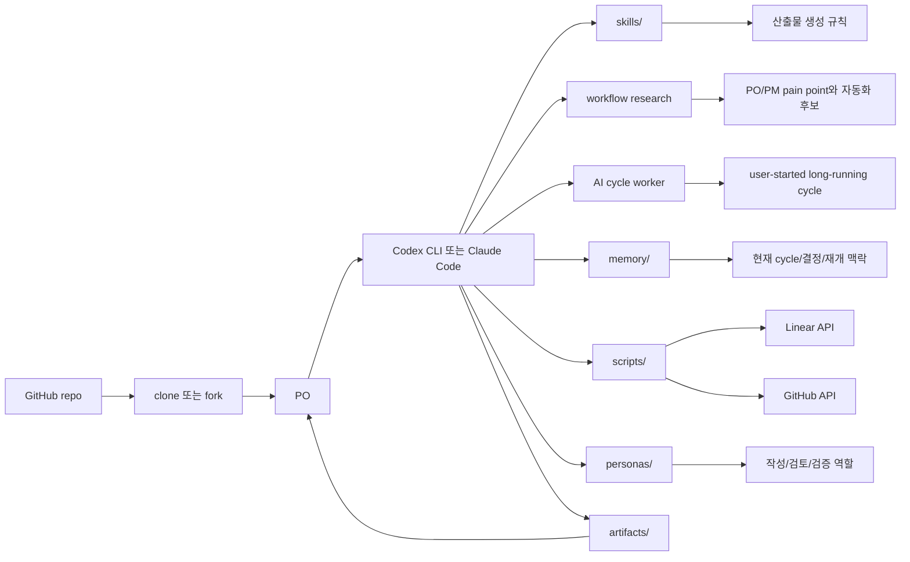

## 2.2 디렉터리 구조

```text
pokit/
├── README.md
├── CHANGELOG.md
├── LICENSE
├── AGENTS.md
├── skills/
│   ├── backlog-manager/SKILL.md
│   ├── sprint-runner/SKILL.md
│   ├── backlog-router/SKILL.md
│   ├── prioritizer/SKILL.md
│   ├── abtest-planner/SKILL.md
│   ├── persona-test-author/SKILL.md
│   ├── prd-author/
│   │   ├── SKILL.md
│   │   └── template.md
│   ├── design-doc-author/
│   └── acceptance-criteria-author/
├── personas/
│   ├── po-author.yaml
│   ├── user-persona-b2b-admin.yaml
│   ├── user-persona-new-user.yaml
│   ├── ux-reviewer.yaml
│   ├── engineering-reviewer.yaml
│   └── qa-validator.yaml
├── workflows/
│   ├── po-pm-workflows.yaml
│   ├── cycle-worker.yaml
│   ├── document-pipeline.yaml
│   ├── validation-pipeline.yaml
│   └── hooks.yaml
├── schemas/
│   ├── artifact.schema.yaml
│   ├── experiment.schema.yaml
│   ├── priority-score.schema.yaml
│   └── review-result.schema.yaml
├── memory/
│   ├── current-cycle.md
│   ├── current-cycle.yaml
│   ├── decision-log.md
│   ├── decision-log.yaml
│   ├── resume-brief.md
│   └── context-map.yaml
├── artifacts/
│   ├── prds/
│   ├── designs/
│   ├── criteria/
│   ├── experiments/
│   ├── persona-tests/
│   ├── sprints/
│   ├── manifests/
│   ├── priority-reports/
│   └── visualizations/
├── scripts/
│   ├── linear.ts
│   ├── github.ts
│   ├── cycle-worker.ts
│   ├── hooks.ts
│   └── README.md
├── docs/
│   ├── PRD.md
│   ├── DESIGN.md
│   ├── po-pm-research.md
│   ├── skill-authoring.md
│   └── linear-conventions.md
├── .env.example
├── .gitignore
└── pokit.config.yaml
```

## 2.3 GitHub 배포 설계

POKit은 GitHub repo로 배포한다. 사용자는 원본 repo를 직접 clone하거나, 팀/개인용 fork를 만든 뒤 private repo처럼 운영할 수 있다.

배포 단위는 다음과 같다.

- **main branch**: dogfood 가능한 최신 안정 상태
- **release tag**: `v0.x.y` 형식의 검증된 스냅샷
- **README.md**: 첫 사용자가 보는 진입점. 첫 줄은 "POKit의 첫 번째 약속은 신뢰다"로 시작한다.
- **CHANGELOG.md**: skill, workflow, script 변경사항과 migration note
- **.env.example**: 필요한 환경변수 이름만 제공. 실제 토큰은 절대 포함하지 않는다.

사용자 repo 운영 모델은 두 가지를 지원한다.

1. **Clone mode**: 개인이 원본 repo를 clone하고 로컬에서 사용한다.
2. **Fork mode**: 팀이 fork/private repo로 운영하며, memory와 artifacts를 팀 repo에 commit한다.

업데이트 원칙:

- POKit 원본 업데이트는 GitHub pull 또는 upstream merge로 가져온다.
- 사용자의 `memory/`, `artifacts/`, `.env`, local config는 원본 업데이트가 덮어쓰지 않아야 한다.
- release note에는 breaking change, skill rename, config migration을 명시한다.
- Day 2에는 자동 업데이트 도구를 만들지 않는다. 업데이트는 git workflow로 처리한다.

민감정보 원칙:

- 원본 repo에는 토큰, 사용자 artifacts, 실제 고객 데이터가 포함되지 않는다.
- `.env`는 git에 commit하지 않는다.
- artifacts와 memory를 팀 repo에 commit할지 여부는 사용자가 정한다. 단, 민감 데이터가 포함될 수 있음을 README에서 경고한다.

## 2.4 Skill 시스템 설계

각 skill은 디렉터리 하나로 구성한다. `SKILL.md`는 필수이고, `template.md`는 선택이다. `template.md`는 PRD, design doc, acceptance criteria 같은 산출물 형식을 정의한다.

`SKILL.md` 형식은 다음 정보를 포함한다.

- 메타데이터: 이름, 설명, 트리거 조건
- AI에게 주는 지시: 무엇을, 어떻게, 어떤 scripts를 호출할지
- 출력 형식: 어디에 저장하고 어떤 형식으로 만들지
- 승인 규칙: dry-run이 필요한 외부 write와 사용자 승인 조건

Codex CLI와 Claude Code 양쪽이 `SKILL.md`를 읽고 트리거에 매칭할 수 있는 형식으로 작성한다. 특정 runtime의 전용 API에 기대지 않고, markdown 지시와 표준 shell/Node 실행을 공통 분모로 삼는다.

## 2.5 PO/PM Workflow Research 설계

POKit은 기능을 먼저 만들고 사용처를 찾지 않는다. PO/PM들이 실제로 하는 일을 웹 리서치로 수집하고, 반복되는 pain point를 작고 실행 가능한 workflow로 바꾼다.

초기 workflow taxonomy는 다음과 같다.

- **Backlog intake**: 회의, 고객 요청, 내부 아이디어를 Linear issue로 정리
- **Backlog refinement**: issue를 PRD/criteria 등 산출물 타입으로 분류하고, 라벨이 없으면 AI가 먼저 제안
- **Prioritization**: customer impact, urgency, strategic fit, effort, dependency 기준으로 순위 제안
- **Sprint/Cycle planning**: 현재 cycle의 issue를 일괄 조회하고 필요한 산출물 생성
- **Requirement writing**: PRD, design doc, acceptance criteria 생성
- **Experiment planning (Day 3+)**: baseline/variant 기반 A/B test와 페르소나 사용자 테스트 설계
- **Growth loop (Day 3+)**: 가설, 목표 지표, 실험 우선순위, 실행 계획, 학습 기록을 반복
- **Stakeholder alignment**: dry-run summary, decision log, approval 기록
- **Review and validation**: 작성자와 검증자 분리, unresolved risk 확인

각 workflow는 `workflows/po-pm-workflows.yaml`에 가볍게 정의한다.

```yaml
workflows:
  backlog_refinement:
    pain_point: "백로그 항목마다 필요한 산출물과 다음 행동을 매번 판단해야 한다."
    trigger_examples:
      - "이번 cycle 준비해줘"
      - "백로그 정리해줘"
    automation:
      - "issue label 확인"
      - "라벨 없는 issue의 산출물 타입 제안"
      - "승인된 산출물 타입 라우팅"
      - "라벨 없는 issue summary"
    human_decision:
      - "라벨 보정"
      - "외부 write 승인"

  experiment_planning:
    pain_point: "변경 전/후 비교 기준과 성공 지표를 매번 새로 정리해야 한다."
    phase: "Day 3+"
    trigger_examples:
      - "이번 cycle 실행"
      - "이 이슈 abtest 설계해줘"
    automation:
      - "hypothesis 작성"
      - "goal metric 설정"
      - "baseline/variant 추출"
      - "primary/guardrail metric 제안"
      - "페르소나별 before/after 사용자 테스트 생성"
    human_decision:
      - "baseline 확정"
      - "성공 기준 승인"

  user_started_cycle_check:
    pain_point: "PO가 퇴근 전에 cycle을 돌려두지 않으면 백로그 준비 상태 점검이 밀린다."
    trigger_examples:
      - "이번 cycle 실행해두고 결과 정리해줘"
      - "퇴근 전에 이번 cycle 돌려줘"
    automation:
      - "현재 cycle issue 조회"
      - "라벨별 산출물 초안 생성"
      - "Needs Clarification 질문 생성"
      - "승인 대기 외부 write plan 생성"
    human_decision:
      - "외부 write 승인"
      - "우선순위 override"

  session_start_nudge:
    pain_point: "PO가 AI를 켰을 때 지금 무엇을 해야 하는지 다시 떠올려야 한다."
    trigger_examples:
      - "Codex/Claude 세션 시작"
      - "POKit 시작해줘"
    automation:
      - "current cycle 확인"
      - "백로그 issue 수와 라벨 상태 요약"
      - "실행 가능한 issue와 정보 부족 issue 구분"
      - "백로그가 비었으면 후보 입력을 부드럽게 요청"
      - "다음 행동 선택지를 1-3개로 제시"
    human_decision:
      - "cycle 실행"
      - "백로그 추가"
      - "nudge 무시"
```

새 skill을 추가하려면 먼저 다음 질문을 통과해야 한다.

1. 이 workflow가 실제 PO/PM 업무에서 반복되는가?
2. 이 작업이 백로그, 문서, 실험, 검증 중 하나에 연결되는가?
3. 자동화 결과를 PO가 dry-run으로 검토하고 승인할 수 있는가?
4. 실패해도 외부 시스템을 망치지 않는가?

## 2.6 Scripts 계층 설계

`scripts/linear.ts`와 `scripts/github.ts`는 다음 원칙을 따른다.

- **Idempotent**: 같은 입력으로 두 번 실행해도 중복 생성하지 않는다. 모든 write에는 idempotency key를 부여한다.
- **Dry-run 우선**: 모든 write 함수는 `{ plan, apply }` 형태로 분리한다. `plan`은 부작용이 없고, `apply`는 사용자 승인 후 호출한다.
- **단독 실행 가능**: POKit 다른 모듈에 의존하지 않는다. AI가 직접 호출할 수 있어야 한다.
- **에러는 친절하게**: API 실패, 토큰 만료, rate limit, 권한 부족을 명확히 설명한다.

함수 예시는 다음과 같다.

```ts
// linear.ts
async function planCreateIssue(input: IssueInput): Promise<Plan>
async function applyCreateIssue(plan: Plan): Promise<Issue>
async function listIssues(cycleId: string): Promise<Issue[]>
async function getCurrentCycle(): Promise<Cycle>
async function addLabel(issueId: string, label: string): Promise<void>
async function planUpdatePriority(input: PriorityInput): Promise<Plan>
async function applyUpdatePriority(plan: Plan): Promise<Issue>
```

`scripts/cycle-worker.ts`는 사용자가 직접 시작한 long-running cycle에서 같은 workflow를 호출하는 얇은 wrapper다. POKit 자체는 스케줄러가 아니며, 사용자 시작 없이 스스로 실행되지 않는다. 사용자가 퇴근 전에 AI cycle을 돌려두면, POKit은 그 세션 안에서 산출물과 summary를 만든다.

## 2.7 Memory 계층 설계

`memory/`는 human-readable markdown과 machine-readable YAML을 함께 사용한다. Markdown은 PO가 읽고 편집하는 설명과 요약을 담고, YAML은 AI와 scripts가 안정적으로 읽는 상태, 포인터, index, read order를 담는다.

- `current-cycle.md`: PO가 읽는 현재 cycle 요약
- `current-cycle.yaml`: current cycle id, 기간, issue count, 마지막 run summary 등 구조화 상태
- `decision-log.md`: PO가 내린 결정. 사용자에게 명시 확인한 경우에만 append-only로 기록한다.
- `decision-log.yaml`: 결정 index, 최신 결정 시각, 관련 issue/artifact pointer
- `resume-brief.md`: 다음 세션 복귀용 요약. 1-2KB를 목표로 한다.
- `context-map.yaml`: AI가 세션 시작 또는 workflow 실행 시 어떤 파일을 어떤 순서로 읽을지 정하는 context 지도

이 파일들은 git에 commit한다. 새 컴퓨터에서 복원되는 컨텍스트의 핵심이다.

Context read order는 `context-map.yaml`이 결정한다. AI는 모든 artifacts를 매번 읽지 않고, `context-map.yaml`이 가리키는 최소 파일만 읽는다. 기본 순서는 다음과 같다.

```yaml
current_cycle:
  id: "2026-W20"
  summary_file: "memory/current-cycle.md"
  state_file: "memory/current-cycle.yaml"
  run_summary: "artifacts/sprints/2026-W20-run-summary.md"

decision_log:
  file: "memory/decision-log.md"
  index_file: "memory/decision-log.yaml"
  latest_decision_at: "2026-05-12T11:30:00+09:00"

read_order:
  - "memory/resume-brief.md"
  - "memory/current-cycle.yaml"
  - "memory/current-cycle.md"
  - "artifacts/sprints/2026-W20-run-summary.md"
  - "memory/decision-log.yaml"
```

PO 기준 context는 다음 여섯 종류로 관리한다.

- **Cycle context**: 현재 cycle, 목표, 포함 issue, 마지막 Run Summary
- **Decision context**: PO가 확정한 정책, 우선순위, 제외 결정
- **Backlog context**: 각 issue의 상태, 라벨, 필요한 산출물, clarification
- **Artifact context**: PRD/criteria/design draft, 생성 근거, content hash
- **Product context**: 타깃 사용자, pain point, 제품 원칙, 금지 범위
- **Session context**: 이전 세션에서 어디까지 했고 다음 액션이 무엇인지

`memory/` 파일은 git merge conflict를 줄이기 위해 다음 규칙을 따른다.

- `decision-log.md`는 append-only다. 새 결정은 timestamp 헤더와 함께 추가만 하고, 기존 결정 문단은 수정하지 않는다.
- `decision-log.yaml`은 decision id와 pointer만 담는 index로 유지한다.
- `current-cycle.md`는 사람이 읽는 요약으로 둔다.
- `current-cycle.yaml`은 최신 cycle id, 이름, 기간, 마지막 run summary 경로만 담는 포인터 파일로 둔다. cycle 상세 본문은 `artifacts/sprints/`에 저장한다.
- `resume-brief.md`는 cycle 종료 후 통째로 다시 쓰는 파일이다. 충돌이 나면 후행 write가 이기며, 병합 대상이 아니라 최신 요약으로 재생성한다.
- `context-map.yaml`은 자동 생성 가능해야 하며, 충돌이 나면 `current-cycle.yaml`과 최신 run summary를 기준으로 재생성한다.
- long-running cycle과 다른 세션이 동시에 memory를 수정할 수 있으므로, `after_run`은 쓰기 전에 현재 파일의 updated marker를 확인하고 변경이 있으면 summary에 conflict warning을 남긴다.

## 2.8 Artifacts 계층 설계

`artifacts/` 안에는 타입별 서브디렉터리를 둔다. 각 산출물은 markdown이다.

frontmatter에는 다음 메타데이터를 기록한다.

- `linear_issue_id`
- `cycle_id`
- `generated_at`
- `skill_used`
- `content_hash`

사용자 수정 여부는 `human_edited` 같은 수동 플래그가 아니라 본문 hash로 판정한다. `after_artifact` hook은 산출물 본문 hash를 frontmatter 또는 manifest에 기록한다. 다음 cycle의 `before_each_issue` hook은 hash를 다시 계산하고, 기록된 hash와 다르면 해당 산출물을 `Needs Approval`로 분류한다. 이 경우 AI는 기존 파일을 자동으로 덮어쓰지 않고 diff 또는 새 버전을 제안한다.

## 2.9 Linear 사용 규칙

Linear issue에는 라벨로 산출물 타입을 표시한다.

- `pokit:prd`
- `pokit:criteria`
- `pokit:design` (Day 3+)
- `pokit:research` (Day 3+)
- `pokit:abtest` (Day 3+)

라벨 없는 issue는 바로 실패시키지 않는다. sprint-runner는 issue 제목/설명/댓글을 보고 적합한 산출물 타입을 제안하고, PO가 승인하거나 수정한 뒤 처리한다. 사용자가 승인하지 않은 라벨 제안은 최종 dry-run summary의 `Needs Label`로 남긴다.

Linear priority는 POKit이 직접 확정하지 않는다. prioritizer skill은 설명 가능한 우선순위 제안과 update plan만 만든다. 실제 priority 변경은 PO 승인 후 `before_external_write` hook을 통과한 뒤 실행한다.

`pokit:abtest` 라벨이 있는 issue는 Day 3 이후 abtest-planner skill과 persona-test-author skill로 라우팅한다. 실험은 baseline이 없으면 설계할 수 없으므로, baseline 지점과 비교 metric이 불명확하면 산출물 생성 전에 사용자에게 확인한다.

POKit은 `pokit:*` 라벨을 조용히 자동 생성하지 않는다. 첫 cycle 실행 전 preflight 단계가 필요한 라벨 존재 여부를 확인한다. 누락된 라벨은 dry-run plan으로 보여주고, 사용자 승인 후 한 번에 생성한다. 라벨 생성도 외부 write이므로 `before_external_write` hook과 idempotency key를 반드시 통과한다.

## 2.10 핵심 워크플로 상세

Cycle 일괄 실행 흐름은 다음과 같다.

1. 사용자가 AI에 "이번 cycle 실행"이라고 말한다.
2. sprint-runner skill이 트리거된다.
3. `scripts/linear.ts`의 `getCurrentCycle()` + `listIssues()`를 호출한다.
4. `before_run` hook을 실행해 환경, token, current cycle, git 상태를 확인한다.
5. 각 issue마다 다음을 수행한다.
   - 라벨을 읽는다 (`pokit:*`).
   - 라벨이 없으면 issue 내용 기반으로 산출물 타입을 제안한다.
   - 승인된 라벨 또는 기존 라벨에 매칭되는 skill을 결정한다 (backlog-router skill의 매핑 규칙).
   - 해당 skill을 호출한다 (issue 정보를 context로 전달).
   - skill이 산출물을 생성해 `artifacts/[type]/[issue-id].md`에 저장한다.
   - `after_artifact` hook을 실행해 frontmatter, manifest, Mermaid, 파일 경로를 검증한다.
6. 모든 산출물, 생성 근거, 정보 부족 항목, 실패 항목을 사용자에게 dry-run으로 보여준다.
7. 사용자 승인 후 `before_external_write` hook을 실행한다.
8. 승인된 외부 write를 실행한다.
   - Linear issue에 산출물 링크 comment 작성
   - 필요시 status 변경
9. `after_run` hook을 실행해 summary와 memory를 업데이트한다.

최종 summary는 PO가 바로 판단할 수 있도록 생성됨, 건너뜀, 승인 필요, 실패 항목을 분리해 보여준다. 특히 "AI가 하지 않은 것"을 상단에 표시한다. 정보가 부족해 만들지 못한 issue, 라벨 승인이 필요한 issue, 외부 write 승인 대기 항목을 먼저 보여줘야 PO의 다음 결정 부담이 명확해진다.

Cycle은 사용자가 명시적으로 시작할 때 실행한다.

- **Immediate run**: PO가 "이번 cycle 실행"이라고 말하면 즉시 실행한다.
- **Long-running run**: PO가 퇴근 전 "이번 cycle 실행해두고 결과 정리해줘"라고 말하면, AI가 가능한 범위의 산출물과 summary를 계속 처리한다.

Long-running run도 외부 write 권한은 갖지 않는다. 파일 산출물, run summary, approval plan은 만들 수 있지만 Linear/GitHub write는 사용자가 돌아와 승인할 때까지 대기한다.

### Session Start Brief and Nudge

세션 시작 시 POKit은 자동 실행을 하지 않는다. `session_start`는 항상 표시되는 **State Brief**와, 상태 변화가 있을 때만 표시되는 **Action Nudge**로 나눈다.

State Brief는 선택적 친절 문구가 아니라 POKit 세션의 필수 lifecycle hook이다. 모든 POKit 세션의 첫 응답은 반드시 짧은 state brief를 포함한다. Action Nudge는 같은 cycle 상태에서 반복하지 않는다. 새 issue, 새 clarification, 라벨 제안, cycle 종료, 승인 대기 같은 상태 변화가 있을 때만 표시한다.

State Brief 표시 항목은 다음과 같다.

- 날짜와 요일
- best-effort 날씨
- 현재 cycle 이름/기간
- backlog count
- 마지막 run summary 위치

Action Nudge 표시 항목은 다음과 같다.

- PO의 결정 대기 항목 수
- cycle 안의 issue 목록
- 각 issue의 라벨, 준비 상태, 다음 행동
- `pokit:*` 라벨이 있는 실행 후보
- 라벨 없는 issue
- 확인 필요 issue
- 추천 다음 행동

Action Nudge는 같은 세션에서 한 번만 표시한다. 사용자가 무시하거나 "나중에"라고 하면 반복하지 않는다. 상태 변화가 없으면 표시하지 않는다.

Brief/Nudge 출력 원칙:

- State Brief는 첫 응답에 반드시 포함한다.
- 자동 실행하지 않는다.
- Day 2 Action Nudge는 추천 다음 행동을 최대 1개만 제안한다.
- Day 3 이후 사용 데이터를 보고 최대 3개까지 확장할 수 있다.
- 제안은 사용자가 그대로 복사해 말할 수 있는 자연어 문장으로 쓴다.
- 반짝임(✨) 또는 말풍선(💬) 이모지를 nudge의 시각적 신호로 사용한다.
- 백로그가 비었으면 백로그 후보 입력을 요청한다.
- 라벨 없는 issue가 있으면 AI가 산출물 타입을 제안한다.
- 실행 가능한 issue가 있으면 cycle 실행을 제안한다.
- 사용자가 "나중에", "skip", "지금은 됐어"라고 하면 같은 세션에서 반복하지 않는다.
- 사용자의 언어 설정에 맞춰 상태명을 표시한다.
- 날씨는 `pokit.config.yaml`의 `brief.weather_enabled`가 true이고 `brief.weather_location`이 있을 때만 표시한다.
- 날씨 조회 실패, 위치 미설정, 네트워크 실패는 workflow를 막지 않고 조용히 생략한다.
- 날씨는 Action Nudge 판단에 사용하지 않는다.

예상 설정은 다음과 같다.

```yaml
brief:
  weather_enabled: true
  weather_location: "Seoul, KR"
```

언어별 상태명은 다음을 기본값으로 한다.

```yaml
status_labels:
  ko-KR:
    ready: "준비됨"
    needs_label: "라벨 필요"
    needs_clarification: "확인 필요"
    needs_approval: "승인 대기"
    skipped: "건너뜀"
    failed: "실패"
  en-US:
    ready: "Ready"
    needs_label: "Needs Label"
    needs_clarification: "Needs Clarification"
    needs_approval: "Needs Approval"
    skipped: "Skipped"
    failed: "Failed"
```

세션 시작 brief는 카운트만 보여주지 않는다. Action Nudge가 필요한 상태라면 PO가 바로 이해할 수 있도록 결정 대기 항목과 관련 issue 목록을 함께 보여준다.

예시:

```text
✨ POKit 브리프

2026년 5월 12일 화요일 · 서울 18°C 흐림 · Cycle 2026-W20

📌 당신의 결정 대기: 2건
- 🏷️ 라벨 제안 승인: POKIT-25
- ❓ 확인 필요 답변: POKIT-21

📦 이번 cycle: 8개 issue

이번 cycle 백로그
- 🔥 POKIT-18 결제 실패 사유 개선
  - 상태: 준비됨
  - 라벨: pokit:prd
  - 다음 행동: PRD draft 생성 가능

- ⭐ POKIT-21 환불 정책 문구 정리
  - 상태: 확인 필요
  - 라벨: pokit:criteria
  - 필요한 답변: 예외 케이스 확인

- 🏷️ POKIT-25 알림 설정 개선
  - 상태: 라벨 필요
  - 다음 행동: AI 제안은 pokit:criteria, 승인 또는 수정 필요

마지막 실행 결과
- artifacts/sprints/2026-W20-run-summary.md

💬 추천 다음 행동
"확인 필요 질문에 답할게"
```

Run Summary는 세션 시작 시 자동으로 새로 생성하지 않는다. Run Summary는 cycle-worker가 실행을 마친 뒤 생성되는 결과 보고서다. 세션 시작 brief는 마지막 Run Summary 링크와 현재 cycle 상태를 함께 보여준다.

`Needs Clarification`은 issue 단위로 흩어 보여주지 않고, 사용자가 한 번에 답할 수 있는 질문 묶음으로 만든다. 예를 들어 run summary 또는 brief에는 "아래 3개 질문에 답하면 2개 issue를 다음 cycle에서 처리할 수 있음"처럼 답변 블록을 제공한다.

### Cycle 일괄 실행 Flowchart

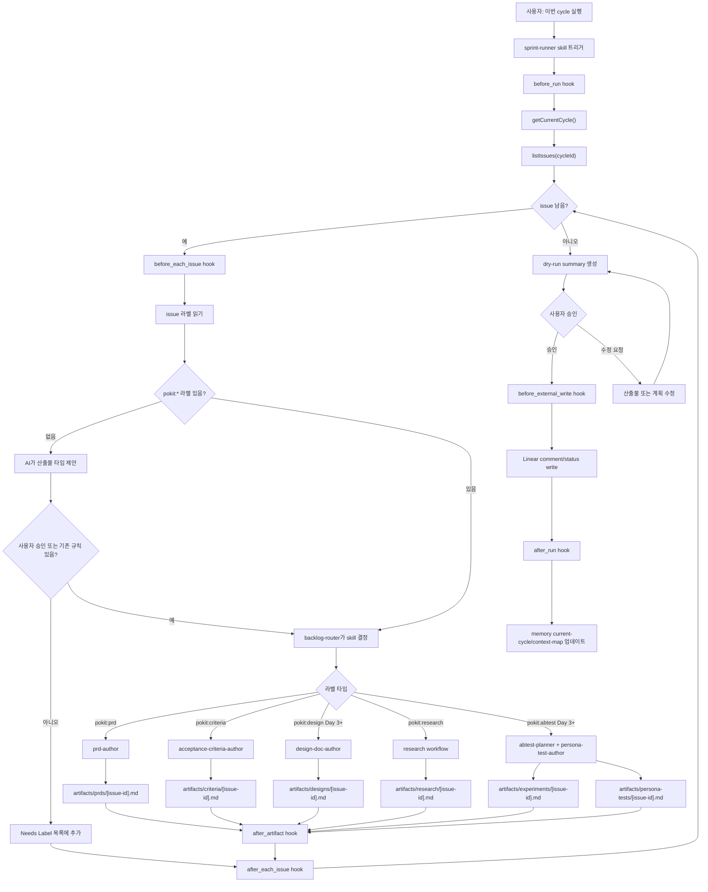

### Cycle 일괄 실행 Sequence

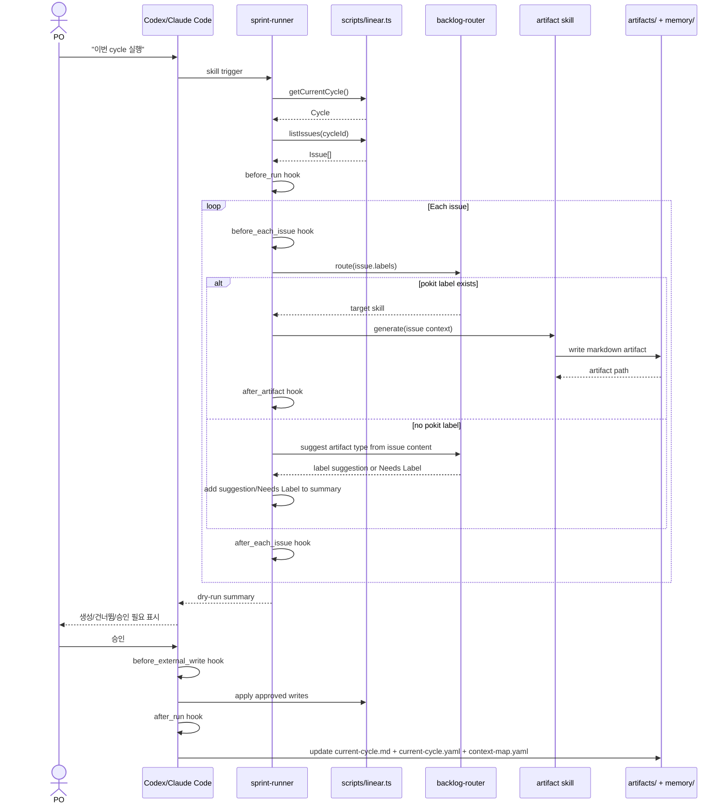

### 백로그 추가 Sequence

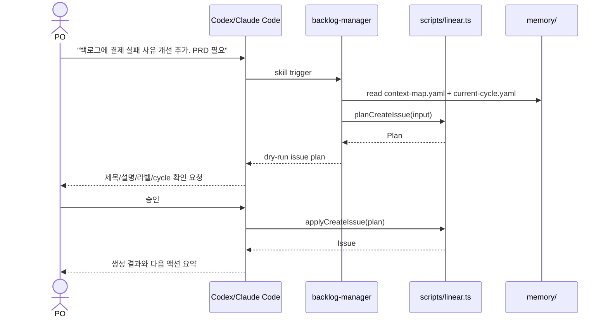

### 새 컴퓨터 셋업 Flowchart

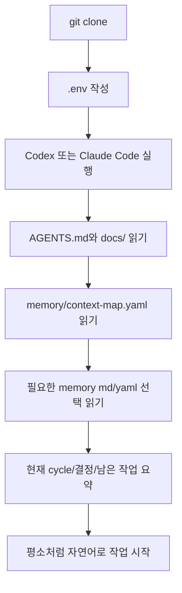

### AI Cycle Worker Flowchart

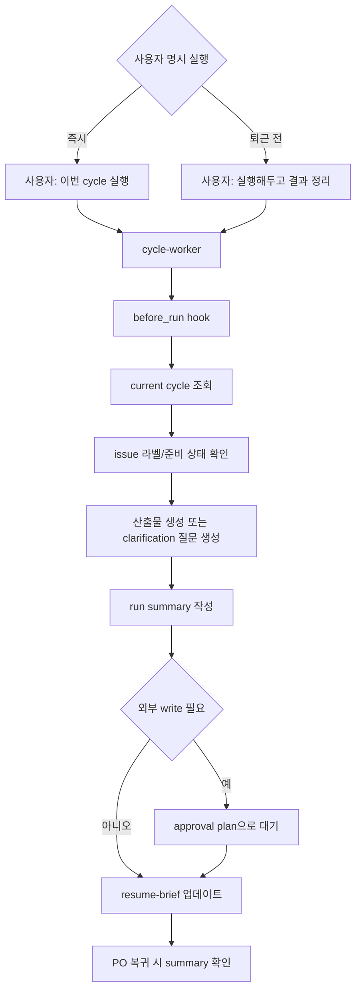

### Session Start Brief/Nudge Flowchart

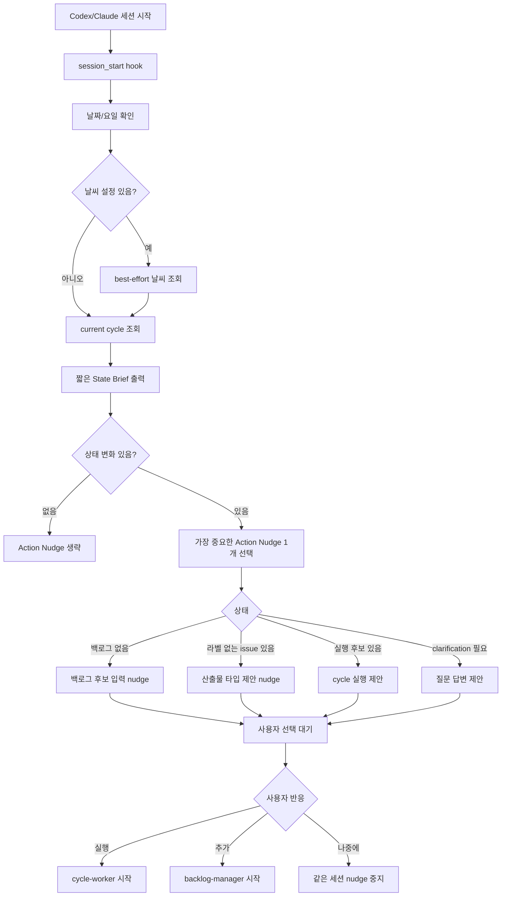

## 2.11 Growth Loop와 가설/목표 설정

POKit의 실험 workflow는 Sean Ellis식 growth loop를 가볍게 따른다. 핵심은 많은 아이디어를 쌓는 것이 아니라, 가설과 목표를 명확히 세우고 작은 실험을 반복해 학습하는 것이다.

기본 loop는 다음과 같다.

1. **Insight**: 사용자 문제, funnel drop-off, VOC, stakeholder 요청을 정리한다.
2. **Hypothesis**: "만약 X를 바꾸면 Y 사용자에게 Z 지표가 개선될 것이다" 형태로 쓴다.
3. **Goal metric**: primary metric과 guardrail metric을 정한다.
4. **Prioritize**: ICE로 빠르게 우선순위를 정한다.
5. **Plan**: baseline, variant, target segment, 성공 기준을 작성한다.
6. **Learn**: 실행 후 결과와 학습을 decision-log 또는 experiment artifact에 남긴다.

가설 템플릿은 다음과 같다.

```text
If we [change],
for [target segment],
then [primary metric] will improve,
because [user/problem insight].
We will not accept the result if [guardrail metric] worsens.
```

실험 산출물은 가설, 목표 지표, 성공/실패 기준이 없으면 `Needs Clarification`으로 분류한다.

## 2.12 백로그 우선순위 알고리즘

POKit의 우선순위 알고리즘은 black-box 예측이 아니라 설명 가능한 점수화 방식으로 시작한다. 목표는 PO의 결정을 대체하는 것이 아니라, cycle planning 전에 비교 기준과 근거를 빠르게 정리하는 것이다.

MVP 기본 방법론은 **ICE-lite**로 한다. 이유는 간단하다. POKit은 초기에는 백로그와 실험 아이디어를 빠르게 정리해야 하며, RICE의 Reach처럼 정확한 도달 사용자 수를 매번 알기 어렵다. RICE는 Phase 2에서 reach 데이터가 충분할 때 선택 옵션으로 제공한다.

ICE-lite scoring factor는 다음과 같다.

- **Impact**: 목표 지표 또는 사용자 문제에 미치는 영향
- **Confidence**: 근거의 확실성. 데이터, VOC, 사용자 관찰, 이전 실험이 있을수록 높다.
- **Ease**: 실행 쉬움. 작고 빠르게 검증할수록 높다.

초기 기본 공식은 다음과 같다.

```text
ICE-lite = Impact × Confidence × Ease
```

각 factor는 1-5 범위다. 점수보다 중요한 것은 근거와 confidence다. 정보가 부족하면 높은 점수를 주지 않고 `Needs Clarification`으로 분류한다.

이모지 우선순위 표시는 다음과 같다.

- 🔥 **P0**: 지금 cycle에서 반드시 확인. ICE 80 이상 또는 긴급 리스크
- ⭐ **P1**: 우선 처리 후보. ICE 45-79
- 🌱 **P2**: 준비되면 처리. ICE 20-44
- 💤 **P3**: 보류 또는 정보 부족. ICE 20 미만 또는 confidence 낮음

RICE는 다음 조건에서만 사용한다.

- reach를 수치로 추정할 수 있다.
- 여러 기능이 서로 다른 사용자 규모에 영향을 준다.
- roadmap 수준의 큰 의사결정이다.
- 팀이 effort를 person-week/month 단위로 합의할 수 있다.

우선순위 결과는 YAML로 저장한다.

```yaml
linear_issue_id: POKIT-123
title: "결제 실패 사유 개선"
method: ice-lite
score:
  impact: 5
  confidence: 3
  ease: 4
  total: 60
priority: "⭐ P1"
confidence: medium
rationale:
  - "결제 실패는 전환율과 고객 문의에 직접 영향을 준다."
  - "현재 cycle goal인 결제 안정성 개선과 맞다."
  - "정확한 개발 범위가 아직 불명확해 confidence는 medium이다."
recommendation: "이번 cycle 우선 후보이나, 개발 범위 clarification 필요"
po_override:
  value: null
  reason: null
```

### 우선순위 Flowchart

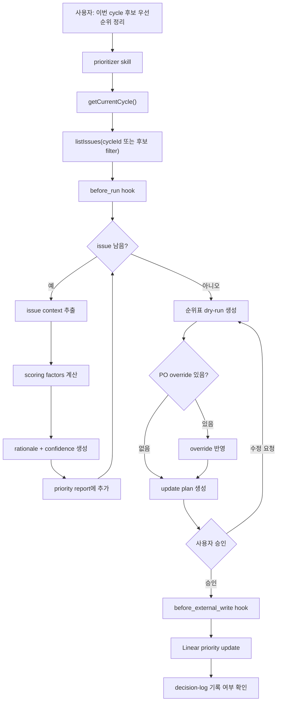

### 우선순위 Sequence

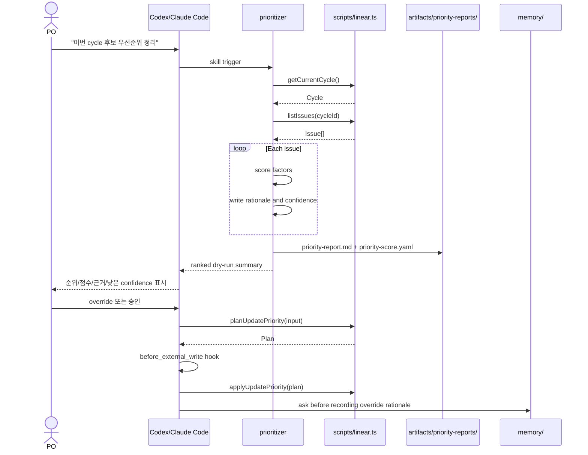

## 2.13 A/B Test와 페르소나 기반 사용자 테스트 설계

abtest-planner skill은 `pokit:abtest` 라벨이 붙은 백로그를 cycle 실행 중 자동으로 처리한다. 특정 변경안이 기존 지점 또는 다른 variant보다 나은지 비교할 수 있도록 before/after 실험 문서를 만든다.

persona-test-author skill은 같은 issue context를 받아 대표 사용자 페르소나별 before/after 사용자 테스트 시나리오를 만든다. 이것이 POKit의 핵심 차별점이다. PO는 백로그에 넣고 cycle을 실행하기만 하면, PRD나 실험 문서뿐 아니라 사용자 관점 검증 초안까지 함께 얻는다.

실험 실행 엔진은 만들지 않는다. POKit은 PO와 팀이 합의할 수 있는 실험 설계, 비교 기준, 페르소나 테스트 산출물을 생성한다.

필수 입력은 다음과 같다.

- **hypothesis**: 변경이 어떤 사용자 행동과 목표 지표를 개선할지에 대한 가설
- **goal_metric**: 실험이 움직이려는 목표 지표
- **baseline**: 현재 비교 기준. 예: 현재 CTA 문구, 기존 온보딩 화면, 기존 가격표
- **variant**: 비교할 변경안
- **target_segment**: 실험 대상 사용자
- **primary_metric**: 성공 판단의 핵심 지표
- **guardrail_metrics**: 악화되면 안 되는 보조 지표
- **duration**: 실험 기간 또는 필요한 sample size 판단 기준
- **success_criteria**: 성공/실패/보류 판정 기준
- **personas**: before/after 사용자 테스트에 사용할 대표 사용자 유형

산출물 YAML 예시는 다음과 같다.

```yaml
experiment_id: POKIT-124-abtest
linear_issue_id: POKIT-124
hypothesis: "혜택을 명확히 드러내면 신규 사용자의 온보딩 완료율이 상승한다."
goal_metric: "onboarding_completion_rate"
baseline:
  name: "current_onboarding_cta"
  description: "현재 온보딩 완료 버튼 문구"
variant:
  name: "benefit_focused_cta"
  description: "혜택 중심 CTA 문구"
target_segment: "신규 가입 사용자"
primary_metric: "onboarding_completion_rate"
guardrail_metrics:
  - "support_ticket_rate"
  - "next_day_retention"
duration: "7 days or until minimum sample is reached"
success_criteria:
  win: "primary metric +3%p 이상, guardrail 악화 없음"
  lose: "primary metric 개선 없음 또는 guardrail 악화"
confidence: medium
persona_tests:
  - persona: "new_user"
    before_expected_behavior: "혜택을 명확히 이해하지 못하고 이탈할 수 있다."
    after_expected_behavior: "CTA의 기대 효과를 이해하고 다음 단계로 이동할 가능성이 높다."
    questions:
      - "이 버튼을 누르면 무엇이 일어날 것 같나요?"
      - "지금 화면에서 가장 망설여지는 부분은 무엇인가요?"
    observation_points:
      - "CTA 의미를 즉시 설명할 수 있는지"
      - "다음 행동을 스스로 선택하는지"
notes:
  - "현재 트래픽 규모가 불명확해 sample size 확인 필요"
```

### A/B Test Flowchart

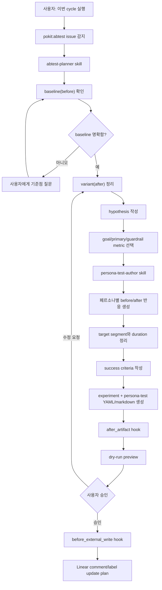

### A/B Test Sequence

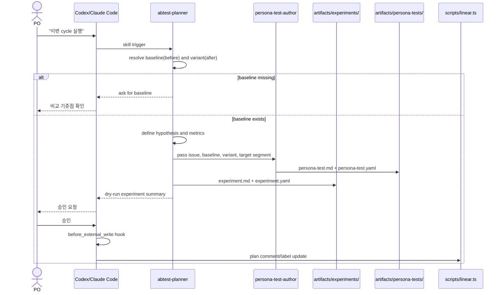

## 2.14 Workflow Hook 설계

Hook은 POKit의 실행 엔진이 아니라 workflow lifecycle에 붙는 안전장치와 품질 게이트다. hook 선언의 정본은 `workflows/hooks.yaml`이다. 이 문서는 설계 배경을 설명하며, hook 목록이 달라지면 `workflows/hooks.yaml`을 우선한다.

기본 hook 포인트는 다음과 같다.

- **before_run**: cycle 실행 전 `.env`, Linear token, current cycle, git 상태, 필수 디렉터리를 확인한다.
- **session_start**: AI 세션 시작 시 날짜, best-effort 날씨, current cycle, backlog count, 마지막 run summary를 짧게 요약한다. action nudge는 상태 변화가 있을 때만 최대 1개 표시한다.
- **preflight_labels**: 첫 cycle 실행 전 `pokit:*` 라벨 존재 여부를 확인하고, 누락 라벨 생성 plan을 만든다.
- **before_implementation**: durable file change 전 Linear cycle 또는 승인된 cycle bundle 귀속 여부를 확인한다. Planning/dry-run은 허용한다.
- **before_each_issue**: issue 처리 전 label, issue id, cycle id, 기존 artifact 존재 여부, content hash 변경 여부를 확인한다.
- **after_artifact**: 산출물 생성 직후 frontmatter, content hash, YAML manifest, Mermaid block, 파일 경로, issue id 매칭을 검증한다.
- **after_each_issue**: issue별 결과를 run summary에 추가한다.
- **before_external_write**: Linear/GitHub write 직전 dry-run plan, 사용자 승인, idempotency key를 확인한다.
- **after_review**: reviewer/validator 결과의 schema와 unresolved risk를 확인한다.
- **after_run**: cycle 실행 종료 후 summary, `memory/current-cycle.md`, `memory/current-cycle.yaml`, `memory/resume-brief.md`, `memory/context-map.yaml`을 업데이트한다.
- **on_error**: 실패 항목을 모으고 failure summary를 작성한다. 자동 재시도는 하지 않는다.

예상 hook 선언은 다음과 같다.

```yaml
hooks:
  session_start:
    - resolve_today
    - resolve_weather_best_effort
    - check_current_cycle
    - summarize_state_brief
    - detect_state_change
    - suggest_one_next_action
    - suppress_repeated_nudge

  preflight_labels:
    - check_pokit_labels
    - plan_missing_label_creation
    - require_user_approval

  before_run:
    - check_env
    - check_current_cycle
    - check_git_status
    - check_required_directories

  before_implementation:
    - require_linear_cycle_or_approved_bundle
    - allow_planning_and_dry_run_without_cycle
    - block_durable_file_changes_without_cycle_context

  loop:
    before_each_issue:
      - load_issue_context
      - resolve_labels
      - check_existing_artifact
      - check_content_hash
    after_each_issue:
      - append_run_summary

  after_artifact:
    - validate_frontmatter
    - record_content_hash
    - validate_manifest_schema
    - validate_mermaid_blocks
    - check_artifact_path

  before_external_write:
    - require_dry_run_plan
    - require_user_approval
    - require_idempotency_key

  after_review:
    - validate_review_result_schema
    - block_on_unresolved_critical_risk

  after_run:
    - write_run_summary
    - update_current_cycle
    - update_resume_brief

  on_error:
    - collect_error
    - write_failure_summary
```

Hook은 실패 시 기본적으로 workflow를 멈추고 사용자에게 dry-run summary와 실패 이유를 보여준다. 단, `after_each_issue` 같은 summary hook 실패는 전체 작업을 막지 않고 warning으로 처리할 수 있다.

## 2.15 동적 페르소나와 병렬 서브에이전트 설계

Phase 2 이후에는 문서 작업의 성격에 따라 페르소나와 검증 구조를 동적으로 선택한다. 목적은 더 많은 에이전트를 쓰는 것이 아니라, 필요한 문맥만 나눠 읽게 해서 토큰 사용량을 줄이고 문서 품질을 높이는 것이다.

기본 역할은 다음과 같다.

- **Planner**: issue와 요청을 읽고 필요한 산출물, 페르소나, 토큰 예산, 검증 단계를 결정한다.
- **Author**: PRD, design, criteria 등 1차 문서를 작성한다.
- **Specialist Reviewer**: UX, engineering, QA, policy 등 특정 관점으로 짧게 검토한다.
- **Validator**: 작성자와 다른 역할로 최종 산출물, YAML manifest, PDF/시각화 결과를 검증한다.
- **Integrator**: 검토 결과를 반영해 최종본과 변경 요약을 만든다.

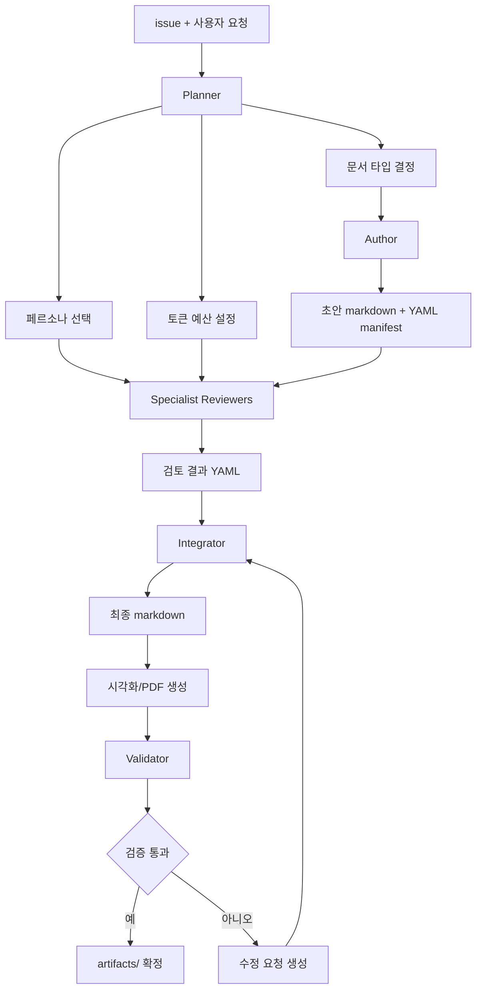

### 병렬 실행 Sequence

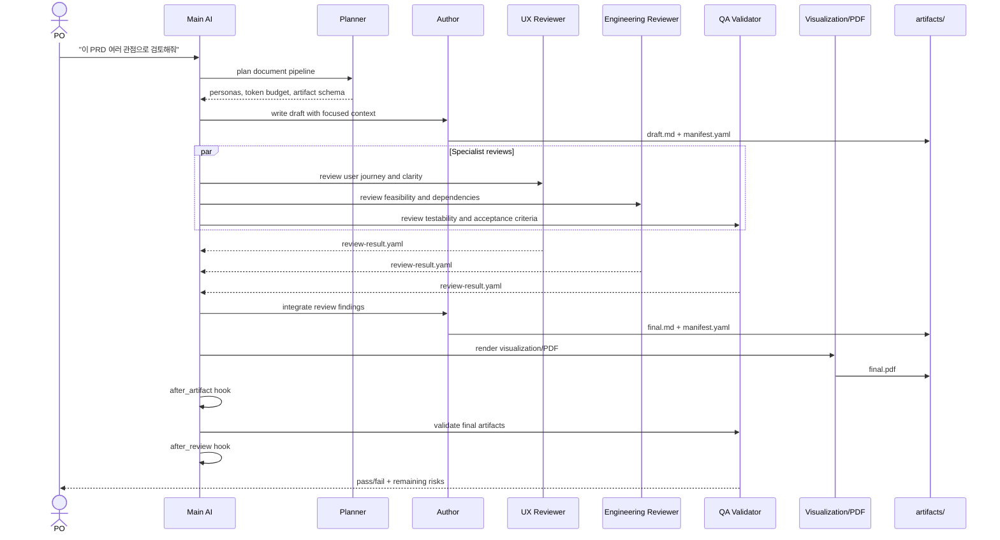

### 토큰 최적화 원칙

- Planner는 전체 context를 읽지만 짧은 실행 계획만 남긴다.
- 각 reviewer는 자신에게 필요한 섹션과 manifest만 받는다.
- 긴 원문 전체를 모든 서브에이전트에 복사하지 않는다.
- reviewer 출력은 자유문이 아니라 `review-result.yaml` 형식으로 제한한다.
- Validator는 최종본과 체크리스트만 보고 pass/fail을 판단한다.

## 2.16 문서 YAML, 시각화, PDF 설계

각 문서 산출물은 markdown 본문과 YAML manifest를 함께 가진다.

```yaml
artifact_id: POKIT-123-prd
linear_issue_id: POKIT-123
cycle_id: cycle-2026-05-12
artifact_type: prd
status: draft
skill_used: prd-author
personas:
  author: po-author
  reviewers:
    - ux-reviewer
    - engineering-reviewer
    - qa-validator
generated_at: 2026-05-12T00:00:00+09:00
content_hash: "sha256:..."
validation:
  validator: qa-validator
  result: pending
  checked_at: null
```

시각화와 PDF는 markdown을 대체하지 않는다. markdown은 source of truth이고, PDF는 공유/검토용 렌더링 결과다. 다이어그램은 Mermaid를 우선 사용하고, PDF 생성은 Phase 2에서 별도 script로 분리한다.

## 2.17 Cross-runtime 호환성

모든 skill은 Codex CLI와 Claude Code 둘 다에서 동작해야 한다.

- `SKILL.md`는 양쪽 시스템의 공통 분모 형식으로 작성한다.
- runtime-specific API 호출은 사용하지 않는다.
- `scripts/`는 표준 TypeScript와 Node 환경을 가정한다.
- 첫 skill부터 양쪽에서 테스트한다.
- 병렬 서브에이전트 실행은 runtime이 지원할 때만 사용한다.
- 병렬 실행을 지원하지 않는 runtime에서는 같은 workflow를 순차 실행한다.
- hook도 runtime 전용 기능에 의존하지 않는다. 병렬 실행이 없더라도 동일한 hook 순서를 유지한다.

Day 2 구현 완료 시점에 동일 시나리오 5개를 Codex CLI와 Claude Code 양쪽에서 실행하고, 산출물 markdown 구조를 diff한다.

1. 백로그 추가
2. cycle 실행
3. 라벨 없는 issue의 산출물 타입 제안
4. dry-run 승인 전 외부 write plan 생성
5. `Needs Clarification` 답변 반영

차이가 발견되면 결정 로그에 어느 runtime을 기준으로 `SKILL.md`를 정렬할지 명시한다. 목표는 문장까지 완전히 같은 결과가 아니라, frontmatter, section heading, status, artifact path, approval plan 구조가 동일하게 나오는 것이다.

동일한 구조는 다음 기준으로 측정한다.

1. frontmatter YAML key 집합이 같다.
2. Markdown H1/H2 heading 순서가 같다.
3. artifact path 패턴이 같다: `artifacts/<type>/<issue-id>.md`.
4. approval plan에 `idempotencyKey`와 `writes[]` 필드가 존재한다.
5. status 값이 같은 집합을 사용한다: `Ready`, `Needs Label`, `Needs Clarification`, `Needs Approval`, `Skipped`, `Failed`.

실행 결과는 `workflows/cross-runtime-diff-results/<runtime>/<scenario>.md`에 저장한다.

## 2.18 외부 쓰기 안전성

- 모든 외부 쓰기는 scripts/ 함수를 통해서만 수행한다.
- `plan` / `apply` 두 단계를 분리한다.
- idempotency key로 중복을 방지한다.
- 실패 시 명확한 에러를 반환하고, 자동 재시도는 하지 않는다.
- 사용자가 승인하지 않은 Linear/GitHub write는 실행하지 않는다.
- 외부 write 직전에는 반드시 `before_external_write` hook을 통과해야 한다.

## 2.19 구현 순서

Day 2 작업:

1. GitHub 배포용 저장소 구조 생성 (디렉터리, README, CHANGELOG, LICENSE, AGENTS.md, .gitignore 등)
2. README 첫 줄에 "POKit의 첫 번째 약속은 신뢰다"를 명시
3. `scripts/linear.ts` 최소 구현: current cycle 조회, issue 조회, issue 생성 plan/apply, comment write plan/apply, label preflight plan/apply
4. `skills/backlog-manager/SKILL.md` 작성
5. `skills/prd-author/` 작성 (`SKILL.md` + `template.md`)
6. `skills/acceptance-criteria-author/` 작성
7. `skills/sprint-runner/` + `skills/backlog-router/` 작성
8. 라벨 없는 issue에 대한 산출물 타입 제안 workflow 작성
9. run summary 작성: 생성됨, 정보 부족, 라벨 필요, 승인 대기, 실패
10. `memory/` Markdown + YAML 이중 구조, `context-map.yaml`, append-only/포인터/후행 write 우선 규칙 작성
11. 산출물 content hash 기록과 human edit 보호 규칙 작성
12. `workflows/hooks.yaml` 초안 작성: session_start, preflight_labels, before-run, before-write, after-artifact, after-run, on-error 호출 지점만 명시
13. 최소 session_start state brief 작성: 날짜, best-effort 날씨, current cycle, backlog count, 마지막 run summary 링크
14. Day 2 action nudge 작성: 상태 변화가 있을 때 추천 다음 행동 최대 1개
15. Codex CLI와 Claude Code cross-runtime diff 테스트 5개 실행

Day 3-7은 dogfood 기간으로 둔다. 부족한 것은 실제 사용 중 발견될 때 추가한다. 우선순위, A/B test, 페르소나 테스트, nudge 강화는 이 기간에 하나씩 붙인다.

Phase 2 작업:

1. `docs/po-pm-research.md`와 `workflows/po-pm-workflows.yaml` 확장
2. `skills/prioritizer/SKILL.md` 작성 (ICE-lite 기본)
3. `skills/abtest-planner/SKILL.md` 작성 (hypothesis/goal required)
4. `skills/persona-test-author/SKILL.md` 작성
5. `personas/` YAML 정의
6. `schemas/` YAML schema 정의
7. `workflows/document-pipeline.yaml` 작성
8. `scripts/hooks.ts` 구현
9. 작성자/검토자/검증자 분리 workflow 추가
10. Mermaid 기반 문서 시각화
11. PDF export script 추가
12. 병렬 실행 가능 runtime에서는 reviewer 병렬화, 불가능한 runtime에서는 순차 fallback. 단, Phase 2 안에서도 가장 마지막에 검토한다.

## 2.20 결정 로그

- GitHub repo로 배포한다. 이유: POKit의 핵심 가치가 clone/fork 가능한 AI 작업환경이기 때문이다.
- npm/global installer/SaaS 배포는 만들지 않는다. 이유: 별도 설치/계정 흐름은 Day 2의 portability와 신뢰 목표를 흐리기 때문이다.
- 별도 CLI 도구 만들지 않음. 이유: 진짜 문제는 cross-runtime portability였고, 별도 CLI는 그 답이 아니다.
- AI provider 추상화 없음. 이유: Codex/Claude Code 자체가 그 역할을 한다.
- 자동 cron 없음. 이유: portability를 깨기 쉽다. 수동 트리거로 시작한다.
- MVP에는 multi-agent orchestration 없음. 이유: Day 2 walking skeleton의 복잡도를 낮추기 위해서다.
- Phase 2에서는 동적 페르소나와 병렬 서브에이전트를 도입한다. 이유: 중요 문서의 품질 검증과 토큰 최적화에 직접적인 가치가 있기 때문이다.
- hook은 실행 엔진이 아니라 안전장치와 품질 게이트로 둔다. 이유: portability를 유지하면서 workflow 안정성을 높이기 위해서다.
- session_start는 항상 표시되는 State Brief와 조건부 Action Nudge로 분리한다. 이유: 첫 응답의 사용 맥락은 유지하면서, 같은 cycle 상태에서 반복되는 nudge 피로를 막기 위해서다.
- State Brief는 필수 lifecycle behavior로 유지한다. 이유: 선택적 안내로 희석되면 실제 사용 시 동작하지 않기 때문이다.
- Day 2 Action Nudge는 최대 1개만 표시한다. 이유: 초기에는 결정 피로를 줄이고 가장 중요한 다음 행동 하나에 집중하기 위해서다.
- 날짜는 Day 2 State Brief에 포함한다. 이유: PO가 오늘의 cycle 판단을 빠르게 시작하기 위한 기본 맥락이기 때문이다.
- 날씨는 Day 2 State Brief에 best-effort 옵션으로 포함한다. 이유: 아침 업무 루틴 감각을 만들 수 있지만, 실패해도 핵심 workflow를 막아서는 안 되기 때문이다.
- 우선순위 알고리즘은 설명 가능한 scoring으로 시작한다. 이유: PO가 신뢰하고 override할 수 있어야 하기 때문이다.
- MVP 우선순위 방법론은 ICE-lite로 한다. 이유: Sean Ellis식 growth experiment 우선순위와 잘 맞고, RICE보다 빠르고 입력 부담이 낮기 때문이다.
- Day 2 MVP 산출물은 PRD draft와 acceptance criteria로 좁힌다. 이유: 첫 주 신뢰를 만들려면 매일 쓰고 검증이 빠른 산출물부터 안정화해야 하기 때문이다.
- A/B test, 페르소나 테스트, growth loop는 Day 3 이후 확장한다. 이유: 실제 데이터 없이 과장된 검증처럼 보이면 PM의 신뢰를 잃기 쉽기 때문이다.
- 라벨 흐름은 "PM이 먼저 라벨을 붙임"만 가정하지 않는다. 이유: PM은 issue를 넣는 시점에 필요한 산출물을 확신하지 못할 수 있으므로, AI가 산출물 타입을 제안하고 PM이 승인하는 흐름이 더 자연스럽기 때문이다.
- memory는 append-only/포인터/후행 write 우선 규칙을 따른다. 이유: 새 컴퓨터와 long-running cycle이 동시에 작업할 때 markdown merge conflict를 줄이기 위해서다.
- memory는 Markdown + YAML 이중 구조로 둔다. 이유: PO는 사람이 읽는 설명을 보고, AI/script는 구조화 상태와 context pointer를 안정적으로 읽어야 하기 때문이다.
- `context-map.yaml`을 context read order의 중심으로 둔다. 이유: 모든 artifacts를 매번 읽지 않고 PO가 지금 결정해야 하는 맥락만 얇게 가져오기 위해서다.
- human edit 보호는 수동 플래그가 아니라 content hash로 판단한다. 이유: 사용자가 직접 편집한 산출물을 AI가 실수로 덮어쓰지 않기 위해서다.
- `pokit:*` 라벨은 preflight에서 확인하고 누락 시 dry-run plan으로 생성한다. 이유: 첫 cycle에서 라벨 부재로 막히지 않으면서도 외부 write 승인 원칙을 지키기 위해서다.
- Codex CLI와 Claude Code 호환성은 동일 시나리오 diff 테스트로 검증한다. 이유: markdown 공통 분모만으로는 skill trigger와 산출물 구조 동일성을 보장할 수 없기 때문이다.
- 병렬 reviewer와 순차 fallback은 Phase 2에서도 가장 마지막에 둔다. 이유: cross-runtime 테스트 매트릭스가 크게 늘어나는 복잡한 기능이기 때문이다.
- A/B test는 실행 엔진이 아니라 비교 기준과 지표를 명확히 하는 산출물 skill로 시작한다. 이유: PO가 실험 전 가설과 성공 기준을 합의하는 것이 먼저이기 때문이다.
- `pokit:abtest`는 abtest-planner와 persona-test-author를 함께 실행한다. 이유: 백로그 실행만으로 before/after 실험 설계와 페르소나 기반 사용자 테스트까지 나오는 것이 POKit의 차별점이기 때문이다.
- POKit workflow는 웹에서 확인한 PO/PM 업무 방식과 pain point를 기반으로 만든다. 이유: 가벼운 자동화가 실제 업무 반복 지점에 붙어야 하기 때문이다.
- AI cycle worker는 사용자가 직접 시작한 long-running cycle을 지원한다. 이유: PO가 퇴근 전에 돌려둔 작업이 계속 산출물 초안과 summary를 만들어 다음 판단 시간을 줄이기 위해서다.
- semantic memory/embeddings 없음. 이유: 산출물이 적을 때 ROI가 낮다.
