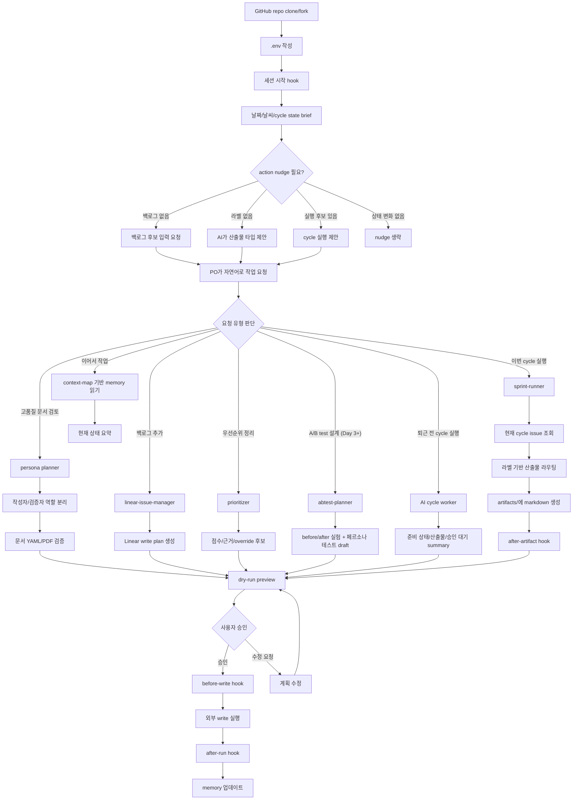

# POKit PRD

## 1.1 문제 정의

PO는 제품 개발 과정에서 반복적인 운영 작업에 많은 시간을 쓴다. PRD 작성, 백로그 정리, 산출물 생성, 이슈 상태 업데이트처럼 중요한 일이지만 매번 새로 사고하기에는 소모적인 작업이 많다.

AI를 사용하더라도 매번 같은 컨텍스트를 다시 설명해야 한다. 팀의 라벨 규칙, 산출물 형식, 현재 cycle, 이전 결정사항을 AI가 안정적으로 기억하지 못하면 PO는 결국 프롬프트를 관리하는 사람이 된다.

컴퓨터를 옮기면 작업 환경이 따라오지 않는 문제도 있다. 로컬 설정, 템플릿, 메모리, 작업 규칙이 흩어져 있으면 새 환경에서 다시 세팅해야 하고, AI 작업의 재현성이 떨어진다.

또한 백로그를 하나씩 처리하면 전체 cycle의 진행 상황을 추적하기 어렵다. PO가 원하는 것은 개별 요청 자동화가 아니라, cycle 안의 여러 백로그를 한 번에 훑고 필요한 산출물과 검증 계획을 일괄 생성하는 작업환경이다. 더 나아가 PO가 퇴근 전에 AI cycle을 직접 시작해두면, AI가 그 작업을 계속 처리하고 다음 의사결정에 필요한 초안을 준비해둘 수 있다.

백로그 우선순위도 PO에게 반복적인 부담이다. 고객 가치, 긴급도, 리스크, 의존성, 작업 크기를 매번 머릿속으로 비교하면 cycle planning이 느려지고 결정 근거가 남지 않는다. AI가 우선순위를 제안하더라도 근거가 불투명하면 PO가 신뢰하기 어렵다.

POKit은 PO/PM 업무를 새로 정의하려는 도구가 아니다. 실제 PO/PM들이 수행하는 업무 방식(사용자 니즈 이해, 백로그 관리, 우선순위 결정, 요구사항 정리, 이해관계자 정렬, 피드백 반영)을 웹 리서치로 수집하고, 그 안에서 반복되는 pain point만 가볍게 자동화한다.

POKit의 첫 번째 약속은 신뢰다. AI는 cycle 안에서 산출물과 승인 계획을 만들 수 있지만, Linear/GitHub 같은 외부 시스템의 상태는 사용자의 명시적 승인 없이는 절대 바꾸지 않는다.

## 1.2 목표

- PO가 Linear 백로그를 cycle 단위로 일괄 처리할 수 있게 한다.
- AI가 백로그 항목을 읽고 필요한 산출물 타입을 제안하며, 승인된 항목에 대해 산출물 draft를 생성한다.
- Codex CLI와 Claude Code 양쪽에서 같은 워크플로가 동작한다.
- GitHub에 배포된 POKit repo를 clone 또는 fork해 사용할 수 있다.
- git clone만으로 새 컴퓨터에서 즉시 사용 가능하다.
- PO가 승인하기 쉬운 dry-run preview를 제공해 외부 write에 대한 불안감을 낮춘다.
- 현재 cycle, 결정사항, 재개 요약을 repo 안에 남겨 반복 설명을 최소화한다.
- Phase 2 이후 문서 작업 성격에 맞는 페르소나와 LLM 사용 전략을 선택해 토큰 비용과 결과 품질을 함께 최적화한다.
- Phase 2 이후 작성자와 검증자를 분리해 문서 품질을 안정적으로 확인한다.
- workflow hook으로 작업 전/후 안전 검사와 품질 검증을 자동화한다.
- Day 3 이후 백로그 우선순위를 설명 가능한 점수와 근거로 제안하고, PO가 쉽게 override할 수 있게 한다.
- 백로그에 항목을 넣고 cycle을 실행하면, 먼저 PRD draft와 acceptance criteria처럼 매일 쓰는 산출물의 신뢰도를 확보한다.
- A/B test와 페르소나 기반 사용자 테스트는 PRD/criteria workflow가 안정된 뒤 확장한다.
- 웹에서 수집한 PO/PM 업무 패턴과 pain point를 기반으로 workflow 자동화 템플릿을 지속적으로 보정한다.
- AI cycle worker가 사용자가 직접 시작한 long-running cycle을 처리해, PO가 자리를 비운 동안에도 백로그 준비 상태를 점검하고 다음 액션 초안을 만든다.
- Day 3 이후 모든 실험성 작업은 가설, 목표 지표, 성공 기준을 먼저 세운 뒤 실행한다.
- 세션 시작 시 항상 짧은 state brief를 보여주고, 백로그가 비었거나 라벨/clarification처럼 상태 변화가 있을 때만 action nudge를 실행한다.

## 1.3 리서치 기반 가정

POKit의 workflow는 일반적인 PO/PM 업무 패턴을 기준으로 설계한다.

- PO/PM은 사용자 니즈, 비즈니스 목표, 기술 제약 사이에서 우선순위를 결정한다.
- 제품 백로그는 roadmap과 요구사항에서 파생되며, 지속적으로 정리되고 우선순위가 바뀐다.
- 좋은 백로그 관리는 customer priority, urgency, implementation difficulty, dependency 같은 기준을 함께 고려한다.
- PM/PO는 이해관계자 정렬과 의사결정 근거 설명에 많은 시간을 쓴다.
- backlog refinement와 iteration planning 전에 항목을 충분히 구체화해야 개발팀이 실행할 수 있다.
- 성장 실험은 아이디어를 많이 내는 것보다 가설, 목표 지표, 우선순위, 실행, 학습을 반복하는 loop가 중요하다.

따라서 POKit은 "PO가 해야 할 판단"을 대체하지 않고, 판단 직전의 반복 작업을 자동화한다. 예를 들어 백로그 항목을 읽고, 산출물 타입을 제안하고, 우선순위 근거를 정리하고, 산출물 draft를 만들어 PO가 검토할 수 있게 한다. 모든 산출물은 최종본이 아니라 draft이며, "왜 이렇게 만들었는지"와 "무엇을 하지 못했는지"를 함께 명시한다.

참고한 웹 리서치:

- Atlassian Product Owner: backlog 관리, 우선순위, 이해관계자 커뮤니케이션
- Atlassian Product Backlog: roadmap/requirements 기반 backlog, customer priority, urgency, difficulty, dependency
- Atlassian Product Manager: 사용자 니즈, 비즈니스 목표, 기술/UX 균형, stakeholder alignment
- Sean Ellis / Hacking Growth: high-tempo testing, ICE 기반 실험 우선순위, 학습 loop

## 1.4 대상 사용자

- 초기/주니어 PO
- Codex CLI 또는 Claude Code 중 하나라도 쓰고 있는 사용자
- Linear와 GitHub을 사용하는 팀
- GitHub repo를 clone/fork해서 팀 작업환경으로 관리하는 사용자
- AI를 이미 쓰고 있지만, 매번 맥락을 다시 설명하는 데 피로를 느끼는 PO

## 1.5 배포/사용 모델

POKit은 GitHub에 배포되는 repo product다. 사용자는 POKit GitHub repo를 clone하거나 fork한 뒤, 자신의 Linear/GitHub 토큰과 팀 설정을 `.env`와 config에 채워 사용한다.

기본 사용 흐름은 다음과 같다.

1. GitHub에서 POKit repo를 clone 또는 fork한다.
2. `.env.example`을 보고 로컬 `.env`를 작성한다.
3. 평소 쓰는 AI runtime(Codex CLI 또는 Claude Code)을 repo 루트에서 실행한다.
4. AI는 `AGENTS.md`, `docs/`, `skills/`, `memory/context-map.yaml`을 읽고 필요한 context만 선택해 POKit workflow를 실행한다.
5. 생성된 artifacts와 memory는 사용자의 fork/repo에 남는다.

배포 모델의 원칙은 다음과 같다.

- POKit 원본 repo에는 민감한 토큰, 실제 고객 데이터, 사용자의 artifacts를 포함하지 않는다.
- 사용자는 자신의 fork나 private repo에서 memory와 artifacts를 관리한다.
- POKit 업데이트는 GitHub pull 또는 upstream merge로 가져올 수 있어야 한다.
- 배포는 GitHub repo와 release/tag 중심으로 한다. npm package, 별도 CLI installer, SaaS 계정 생성은 Day 2 범위가 아니다.

## 1.6 고객 시나리오

### 고객 시나리오 1 - 월요일 아침, PO가 cycle 계획을 정리한다

초기 PO인 민지는 월요일 아침 Linear의 이번 cycle을 연다. 지난주에 쌓인 아이디어, 버그, 개선 요청이 섞여 있고 어떤 항목은 PRD가 필요하고 어떤 항목은 acceptance criteria만 있으면 된다.

민지는 Codex 또는 Claude Code를 켠다. 세션 시작 hook은 날짜, 현재 cycle, 백로그 수, 마지막 Run Summary 링크를 짧은 state brief로 보여준다. action nudge는 백로그가 비었거나, 라벨 제안/clarification/새 issue처럼 사용자가 결정할 변화가 있을 때만 한 개 표시한다.

민지가 "이번 cycle 준비해줘"라고 말하면 POKit은 현재 cycle의 issue를 읽고, 라벨이 있는 항목과 없는 항목을 구분한다. 라벨 없는 issue는 건너뛰기 전에 AI가 먼저 적합한 산출물 타입을 제안한다. 예를 들어 PRD가 필요한 항목, criteria만 있으면 되는 항목, 아직 정보가 부족한 항목을 요약해 보여준다.

민지는 dry-run preview를 보고 라벨 제안을 승인하거나 수정한다. POKit은 승인된 항목만 산출물로 만들고, 결과를 artifacts/에 저장한다. 생성하지 못한 issue는 침묵하지 않고 "정보 부족"과 필요한 질문을 남긴다. 민지는 "이번 cycle에서 무엇을 논의해야 하는지"를 회의 전에 빠르게 파악한다.

### 고객 시나리오 2 - 회의 중 나온 요구사항을 바로 백로그에 넣는다

스탠드업 중 고객 지원팀에서 "결제 실패 사유를 더 명확히 보여달라"는 요청이 나온다. 민지는 AI에게 "백로그에 결제 실패 사유 개선 추가해줘. PRD 필요"라고 말한다.

POKit은 issue 제목, 설명, 라벨(`pokit:prd`), cycle 후보를 dry-run으로 보여준다. 민지가 승인하면 Linear issue를 생성하고, 필요하면 PRD 초안 생성까지 이어간다.

민지는 Linear 입력 폼을 열고 필드를 고민하는 대신, 자연어로 백로그를 남기고 승인만 한다.

### 고객 시나리오 3 - Cycle planning 전에 우선순위를 정리한다

민지는 cycle planning 전에 "이번 cycle 후보 우선순위 정리해줘"라고 말한다.

POKit은 Linear의 후보 issue를 가져와 고객 영향, 긴급도, 전략 적합도, 리스크 감소, 의존성, 작업 크기 기준으로 점수를 계산한다. 결과는 단순 순위가 아니라 "왜 이 항목이 먼저인지"를 짧은 근거와 함께 보여준다.

민지는 제안 순위를 보고 몇 개 항목을 직접 override한다. POKit은 override 이유를 decision-log에 남길지 확인하고, 승인된 우선순위만 Linear update plan으로 만든다.

### 고객 시나리오 4 - 새 노트북에서 어제 작업을 이어간다

민지는 새 컴퓨터에서 POKit repo를 clone하고 `.env`를 채운다. AI를 켜고 "이어서 작업하자"라고 말한다.

AI는 `memory/context-map.yaml`을 먼저 읽고, 필요한 `memory/current-cycle.md`, `memory/current-cycle.yaml`, `memory/decision-log.md`, `memory/resume-brief.md`, 마지막 run summary만 선택해 읽는다. 민지는 이전 컴퓨터에서 어떤 프롬프트를 썼는지 기억하지 않아도 같은 방식으로 작업을 이어간다.

### 고객 시나리오 5 - 중요한 PRD를 여러 관점으로 검증한다 (Phase 2)

민지는 결제 정책 변경 PRD를 준비한다. 이 문서는 고객 경험, 정책 리스크, 개발 난이도, QA 관점이 모두 중요하다.

민지가 "이 PRD는 여러 관점으로 검토해서 최종본 만들어줘"라고 말하면 POKit은 문서 성격을 보고 적절한 페르소나를 선택한다. 예를 들어 PO 작성자, UX 검토자, 엔지니어링 검토자, QA 검토자가 각각 다른 관점으로 문서를 확인한다.

각 검토자는 필요한 부분만 읽고 짧은 검토 결과를 남긴다. 마지막 검증자는 작성자와 다른 역할로 전체 산출물, YAML 메타데이터, PDF 시각화 결과를 확인한다. 민지는 긴 문서를 직접 여러 번 읽지 않아도 누락된 정책, 애매한 요구사항, 검증 불가능한 acceptance criteria를 빠르게 발견한다.

### 고객 시나리오 6 - 백로그 실행만으로 A/B test와 페르소나 테스트를 만든다 (Day 3+)

민지는 온보딩 화면의 CTA 문구를 바꾸고 싶지만, 감으로 결정하고 싶지 않다. Linear 백로그에 "온보딩 CTA 개선" issue를 넣고 `pokit:abtest` 라벨을 붙인다.

민지가 "이번 cycle 실행"이라고 말하면 POKit은 해당 issue를 보고 현재 CTA를 baseline, 새 CTA를 variant로 정리한다. 동시에 대상 사용자 페르소나를 구성하고, 각 페르소나가 변경 전/후 화면에서 어떻게 반응할지 사용자 테스트 관점의 질문과 관찰 포인트를 만든다.

POKit은 A/B test 설계, before/after 비교표, 페르소나 기반 사용자 테스트 시나리오, 성공 기준을 `artifacts/experiments/`에 생성한다. 단, 이 기능은 PRD/criteria 산출물의 신뢰도가 확인된 뒤 확장한다. 민지는 백로그에 넣고 cycle 실행만 했는데도 실험 설계와 사용자 관점 검증 초안을 함께 얻는 경험을 목표로 한다.

### 고객 시나리오 7 - 퇴근 전에 AI cycle을 돌려두고 다음 날 확인한다

민지는 퇴근 전에 "이번 cycle 실행해두고 결과 정리해줘"라고 말한다. POKit은 사용자가 시작한 AI cycle 안에서 현재 cycle issue를 읽고 라벨, 준비 상태, 필요한 clarification 질문, 생성 가능한 산출물을 정리한다.

다음 날 아침 민지는 run summary를 보고 `Generated`, `Needs Clarification`, `Needs Approval`, `Failed` 항목을 확인한다. AI가 외부 시스템을 마음대로 바꾸지는 않는다. Linear comment나 status 변경은 승인 대기 상태로 남는다.

## 1.7 핵심 사용 시나리오

### 시나리오 A - 백로그 추가

사용자가 AI에 "백로그에 X 추가"라고 말한다.

linear-issue-manager skill이 트리거되고, AI는 필요한 최소 정보만 확인한 뒤 Linear issue 생성 계획을 만든다. 먼저 dry-run으로 제목, 설명, 라벨, cycle, idempotency key를 보여준다. 사용자가 승인하면 scripts/linear.ts가 Linear에 issue를 생성한다.

### 시나리오 B - Cycle 일괄 실행

사용자가 AI에 "이번 cycle 실행"이라고 말한다.

sprint-runner skill이 현재 cycle의 모든 issue를 가져온다. 각 issue의 라벨(`pokit:prd` 등)에 따라 backlog-router skill이 적절한 산출물 skill을 결정한다. 라벨이 없으면 바로 실패시키지 않고, AI가 issue 내용을 기준으로 산출물 타입을 제안한다. 사용자가 제안을 승인하거나 수정한 항목만 artifacts/ 디렉터리에 markdown 산출물을 생성한다.

모든 외부 write는 먼저 dry-run으로 표시한다. 사용자가 승인한 뒤에만 Linear comment 작성, status 변경 같은 외부 write를 실행한다.

### 시나리오 C - 백로그 우선순위 제안

사용자가 AI에 "이번 cycle 후보 우선순위 정리"라고 말한다.

prioritizer skill이 후보 issue를 가져온다. 각 issue를 점수화하고, 점수 근거와 confidence를 표시한다. PO가 수정하면 override를 반영한다. Linear priority/status 변경은 dry-run으로 보여준 뒤 승인 후 실행한다.

### 시나리오 D - A/B test 설계 (Day 3+)

사용자가 Linear 백로그에 `pokit:abtest` 라벨이 붙은 issue를 넣고 "이번 cycle 실행"이라고 말한다.

abtest-planner skill이 baseline(before), variant(after), 가설, 목표 지표, guardrail, 기간, 성공 기준을 정리한다. persona-test skill은 대표 사용자 페르소나별 before/after 반응, 기대 행동, 우려, 질문을 생성한다. 비교 기준점이나 목표 지표가 없으면 먼저 clarification 질문을 만든다. 산출물은 `artifacts/experiments/`에 저장하고, 외부 write는 dry-run 후 승인받는다.

### 시나리오 E - 퇴근 전 AI cycle 실행

사용자가 "이번 cycle 실행해두고 결과 정리해줘"라고 말한다.

POKit은 사용자가 시작한 세션 안에서 현재 cycle을 읽고, 라벨링된 issue의 산출물 초안과 준비 상태 summary를 만든다. 사용자가 자리를 비워도 파일 산출물과 내부 summary는 만들 수 있지만, Linear/GitHub 외부 write는 승인 대기 plan으로만 남긴다.

### 시나리오 F - 새 컴퓨터 셋업

사용자가 새 컴퓨터에서 POKit repo를 clone한다.

`.env`를 채우고 평소 쓰는 AI(Codex 또는 Claude Code)를 켠다. AI는 repo 안의 skills, docs, `memory/context-map.yaml`을 읽고 필요한 memory와 artifacts만 선택해 기존 workflow를 이어간다.

## 1.8 MVP 범위

### Day 2 MVP 포함

- 산출물 2종: PRD draft, acceptance criteria
- Linear 백로그 CRUD
- GitHub repo 기반 배포/clone/fork 사용 흐름
- `.env.example` 기반 로컬 설정
- 사용자가 직접 시작하는 long-running AI cycle worker
- Cycle 단위 일괄 실행
- 라벨 기반 산출물 타입 라우팅
- 라벨 없는 issue에 대한 산출물 타입 제안
- dry-run + 사용자 승인
- idempotent 외부 쓰기
- 현재 cycle과 결정사항을 human-readable markdown + machine-readable YAML memory로 관리
- `memory/context-map.yaml` 기반 context read order 관리
- 생성 산출물의 기본 frontmatter 기록
- cycle 실행 결과 요약: 생성됨, 건너뜀, 승인 필요, 실패
- 실패한 산출물과 정보 부족 항목 표시
- 산출물별 참고 issue, 사용한 맥락, 생성 근거 표시
- 단일 작성자 기반 PRD/criteria 생성과 간단한 self-check
- 기본 workflow hook: before-run, before-write, after-artifact, after-run, on-error
- 최소 session_start state brief: 날짜, 현재 cycle, backlog count, 마지막 run summary 링크
- 조건부 action nudge: 상태 변화가 있을 때 추천 다음 행동 최대 1개
- best-effort 날씨 표시: 설정된 위치와 날씨 조회가 가능할 때만 state brief 한 줄에 표시하고, 실패 시 조용히 생략
- Codex CLI와 Claude Code cross-runtime diff 테스트 5개
- memory append-only/포인터/YAML index 규칙과 resume-brief 후행 write 우선 규칙
- 산출물 본문 hash 기반 human edit 보호
- 첫 cycle 전 `pokit:*` 라벨 preflight와 누락 라벨 생성 dry-run plan

### Day 3 이후 확장 후보

- PO/PM 업무 패턴 기반 workflow template
- 설명 가능한 백로그 우선순위 제안
- ICE 기반 간단 우선순위 산정과 이모지 우선순위 표시
- 우선순위 override와 근거 기록
- A/B test 실험 설계 산출물 생성
- 페르소나 기반 before/after 사용자 테스트 시나리오 생성
- 가설, 목표 지표, 성공 기준 정의
- baseline/variant/metric 기반 실험 설계
- 백로그 라벨 기반 실험/사용자 테스트 자동 라우팅
- session_start nudge 강화: backlog 상태, 실행 후보, 빈 backlog 안내
- action nudge를 상태 변화 기반 lifecycle behavior로 정착
- 세션 시작 brief 언어 현지화
- 세션 시작 brief의 cycle별 백로그 목록과 다음 행동 표시

### 제외 (Phase 2 이후)

- 회고 자동화
- 일일 브리핑 (메트릭스/뉴스)
- 다관점 검토
- 동적 페르소나 기반 병렬 서브에이전트 실행
- 문서 YAML manifest 표준화
- 문서 시각화와 PDF export
- 작성자/검증자 분리 검증 workflow
- 자동 cron / 알림
- desktop app
- MCP 통합

## 1.9 명시적으로 만들지 않을 것 (anti-features)

- 별도 CLI 진입점 (`pokit init`, `pokit chat` 등)
- npm/global installer 기반 배포
- SaaS 계정 생성형 배포
- 별도 chat UI
- workspace init/setup wizard
- AI provider 추상화
- runtime tool loop / tool descriptor 시스템
- 무제한 자율 multi-agent orchestration
- 사용자 승인 없는 자동 loop 실행
- 사용자 시작 없이 스스로 실행되는 예약 cycle
- 사용자를 방해하는 반복 nudge
- state brief 없이 세션을 시작하는 POKit workflow
- 같은 cycle 상태에서 반복되는 action nudge
- 설명 불가능한 black-box 우선순위 자동 결정
- baseline 없는 실험 자동 실행
- 가설과 목표 지표 없는 실험 실행
- 실제 사용자 데이터 없이 성공을 확정하는 자동 판정
- PM을 대체하는 자동 의사결정
- 출처와 근거 없는 산출물 생성
- 실패하거나 건너뛴 issue를 숨기는 cycle summary
- 무거운 PM suite 또는 올인원 product management platform
- 복잡한 플러그인 마켓플레이스 또는 skill registry

## 1.10 사용자 여정 요약

## 1.11 성공 기준

- 사용자가 GitHub repo를 clone 또는 fork해 30분 안에 POKit 세션을 시작할 수 있다.
- 사용자가 새 컴퓨터에서 30분 안에 첫 PRD를 생성할 수 있다.
- Cycle 실행 한 번으로 cycle 안의 PRD/criteria 대상 issue에 draft 산출물 또는 정보 부족 사유가 생성된다.
- Codex CLI와 Claude Code 양쪽에서 동일한 입력에 대해 동일한 구조의 결과가 나온다.
- 본인이 1주 자체 사용 후 매일 사용할 만큼 반복 가치가 있다.
- 1주 자체 사용 동안 매일 최소 1회 POKit state brief를 확인한다.
- 1주 자체 사용 동안 평일 기준 최소 3회 cycle 실행 또는 cycle 준비 workflow를 실행한다.
- 1주 자체 사용 동안 `Needs Clarification` 항목의 24시간 내 응답률을 기록한다.
- PO가 백로그 일괄 처리 후 "무엇이 생성됐고 무엇이 승인 대기인지"를 1분 안에 파악할 수 있다.
- 모든 산출물에는 참고한 issue, 사용한 맥락, 생성 근거가 함께 남는다.
- 생성하지 못한 issue는 `Needs Clarification`과 필요한 질문이 summary 상단에 표시된다.
- 중요 문서는 Phase 2에서 작성자와 다른 검증자가 확인한 결과를 함께 남긴다.
- 우선순위 제안에는 Phase 2에서 점수, 핵심 근거, PO override 여부가 함께 남는다.
- A/B test 산출물에는 Phase 2에서 baseline, variant, primary metric, guardrail, 성공 기준, 페르소나별 before/after 사용자 테스트가 포함된다.
- 새 workflow 자동화는 웹 리서치로 확인된 PO/PM pain point에 연결되어야 한다.
- 사용자가 직접 시작한 long-running cycle은 파일 산출물과 summary를 만들 수 있지만, 외부 write는 사용자 승인 전까지 실행하지 않는다.
- Phase 2의 모든 실험 산출물에는 가설, 목표 지표, 성공/실패 기준이 포함된다.
- session_start state brief는 모든 POKit 세션의 첫 응답에 포함되어야 한다.
- action nudge는 상태 변화가 있을 때만 표시하며, Day 2에는 최대 1개만 제안한다.
- action nudge는 사용자가 무시하거나 미루면 같은 세션에서 반복하지 않는다.
- Run Summary는 cycle 실행이 끝난 뒤 생성되는 결과 보고서다. 세션 시작 brief는 마지막 Run Summary 링크와 현재 backlog 상태만 요약한다.
