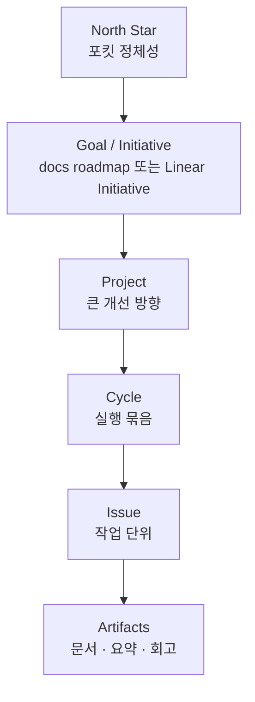
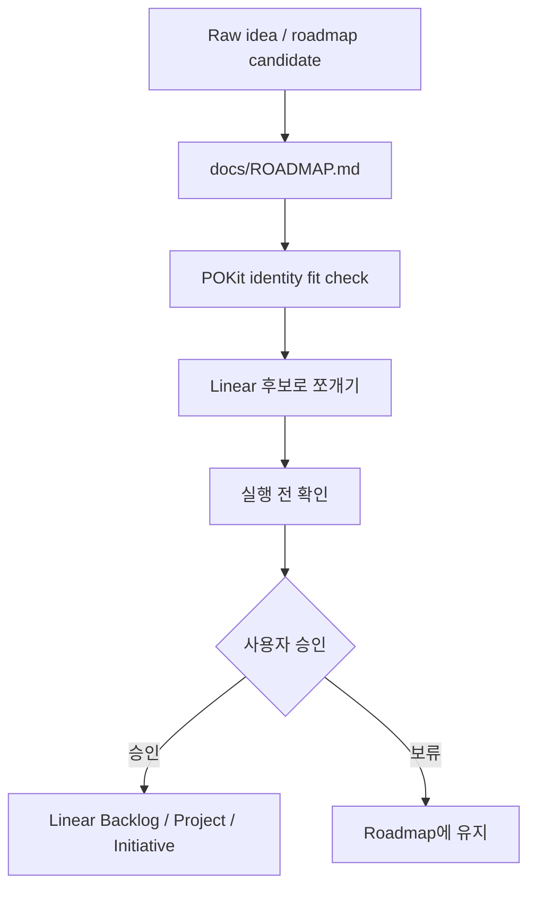
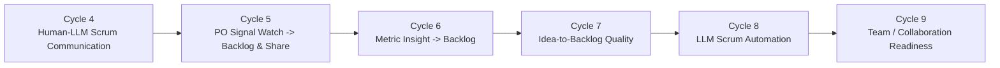
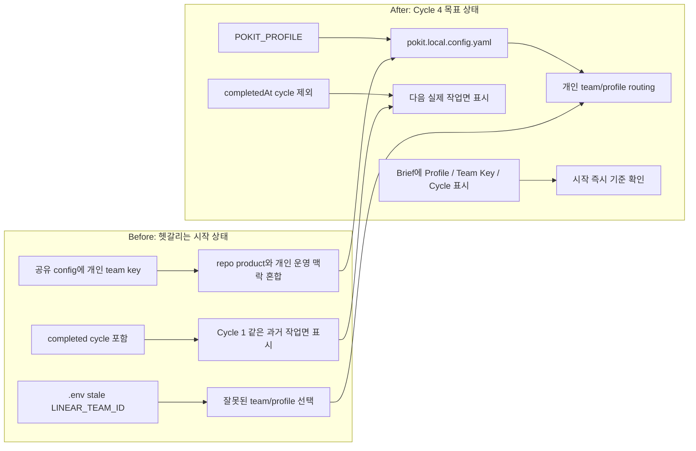
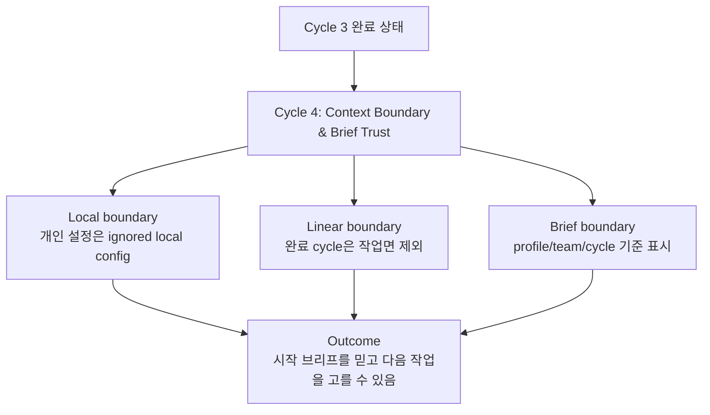

# POKit Roadmap

## 문서 역할

이 문서는 포킷의 로드맵 나침반이다. 큰 제품 방향, initiative, 후보 cycle을 Linear에 넣기 전에 가볍게 정리한다.

Linear를 대체하지 않는다. Linear는 승인된 Project, Cycle, Issue의 실행 추적 시스템이고, 이 문서는 아직 Linear에 넣기 이른 방향과 후보를 보관한다.

## North Star

포킷은 복잡한 관리 도구가 아니다.

사람과 LLM이 함께 스크럼을 굴리게 해주는 가벼운 작업공간이다.

가벼움의 기준은 **작업자인 LLM이 헷갈리지 않는 구조**다. 폴더·문서·메모리 위치가 명확해야 LLM이 매 세션 cold start에서도 같은 판단을 한다. 사용자가 매번 교정하는 비용이 사라질 때 비로소 가볍다.

## 로드맵 원칙

- 포킷은 가볍게 유지한다. 무거운 로드맵 대시보드나 정보 창고로 만들지 않는다.
- 아이디어와 방향은 먼저 문서에 정리하고, 실행 가능한 단위가 되었을 때 Linear로 올린다.
- Linear는 모든 raw idea를 넣는 곳이 아니라 실행 추적 시스템으로 쓴다.
- 로컬 handoff, 요약, 산출물, 이어하기 브리프는 가능한 한 자동으로 남긴다.
- Linear/GitHub처럼 외부에 보이는 상태 변경은 실행 전 확인과 사용자 승인으로 통제한다.
- 모든 로드맵 항목은 backlog -> cycle -> 실행 -> 회고 흐름을 덜 헷갈리게 만들어야 한다.

## Linear 활용 방식

포킷은 Linear를 복제하지 않고 활용한다.

포킷의 roadmap cycle은 Linear cycle과 같은 운영 단위로 맞춘다. Linear의 cycle 객체와 GitHub release 객체는 별개지만, POKit의 Cycle 완료 조건에는 승인된 release가 포함된다. 따라서 사용자가 "Cycle 4"라고 말하면 포킷은 기본적으로 Linear의 해당 작업 cycle을 의미하되, Cycle 완전 완료는 검증된 변경의 commit, push, tag, GitHub release까지 끝난 상태를 뜻한다.

Hotfix는 roadmap cycle 번호 흐름에 끼우지 않는다. 긴급 수정은 `targetVersion`, `releaseKind: hotfix`, `sourceCycle`, `resumeCycle`로 관리하고, Linear cycle number가 hotfix 때문에 차지되었더라도 포킷의 사용자-facing roadmap cycle 이름을 바꾸지 않는다. 필요하면 hotfix는 Linear Project, issue label, 또는 별도 hotfix tracking issue로 묶고, 일반 roadmap cycle과 분리한다.

추천 매핑:

- `docs/ROADMAP.md`: 전체 그림, 미래 방향, 아직 Linear에 올리지 않은 후보.
- Linear Initiative: 장기적으로 추적할 가치가 있는 전략 방향.
- Linear Project: Cycle 4, Cycle 5처럼 큰 개선 흐름.
- Linear Cycle: 포킷 roadmap cycle의 실제 실행 컨테이너.
- Linear Issue: cycle 안에서 처리할 실제 실행 단위.
- Linear Updates: 포킷 요약에서 만든 승인된 상태 업데이트.

Linear 반영 흐름:

## POKit Identity Fit Check

로드맵 항목이 Linear 작업이 되기 전에 확인한다.

1. 사람과 LLM이 함께 스크럼을 굴리는 데 도움이 되는가?
2. 사용자가 더 빨리 이해하거나 더 적은 마찰로 결정하게 되는가?
3. backlog -> cycle -> 실행 -> 회고 흐름에 자연스럽게 들어가는가?
4. Linear와 GitHub repo 위에서 가볍게 동작하는가?
5. 새롭고 무거운 관리 도구가 되지 않는가?
6. 외부 상태 변경은 실행 전 확인과 승인으로 통제되는가?
7. 로컬 맥락은 자동화하되 외부 상태 변경의 승인 경계를 유지하는가?
8. **작업자 LLM이 매 세션에서 헷갈리지 않게 만드는가?** (폴더·문서 위치, 명명 규칙, 어디에 무엇을 두는지가 즉시 명확한가?)

결론은 `진행`, `보류`, `더 작게 쪼개기` 중 하나로 둔다.

## 현재 목표

한 사람과 LLM이 함께 스크럼을 굴릴 때 생기는 소통 비용과 맥락 손실을 줄인다. 특히 LLM이 매 세션에서 같은 구조·같은 위치·같은 규칙을 즉시 인식하게 한다.

## Initiative Map

## Cycle 4: Context Boundary & Brief Trust

목표: 포킷이 여러 Linear team/profile을 오가는 개인 작업환경에서도 공유 repo와 개인 운영 맥락을 섞지 않고, 세션 시작 브리프가 신뢰할 수 있는 작업면을 보여주게 만든다.

Cycle 4는 기존의 "Human-LLM Scrum Communication" 방향 중 가장 먼저 막힌 부분을 좁혀 해결한다. 지금 문제는 보고 형식의 화려함이 아니라, 사용자가 보는 첫 브리프가 "어느 팀, 어느 cycle, 어떤 로컬/외부 상태를 기준으로 말하는가"를 정확히 드러내지 못하는 것이다.

### Cycle 4 실행 묶음

1. POKIT-48 개인 Linear/profile 설정을 repo 밖 로컬 설정으로 분리
2. POKIT-49 세션 브리프가 완료된 cycle을 작업면으로 다시 선택하지 않게 수정
3. POKIT-50 POKit 시작 브리프에 profile/team/cycle 기준을 명확히 표시
4. POKIT-51 Cycle 4 진행 효과를 로드맵에 시각화

후보 백로그:

1. `pokit.local.config.yaml` 지원: 개인 team key와 profile routing은 ignored local config로 이동
2. 공유 `pokit.config.yaml` 정리: 누구에게나 적용되는 기본 설정만 유지
3. profile 선택 우선순위 정리: `POKIT_PROFILE`이 선택되면 stale `LINEAR_TEAM_ID`가 작업면을 가로채지 않게 함
4. completed cycle 제외: `completedAt`이 있는 cycle은 다음 작업 후보에서 제외
5. brief source 표시: `Profile`, `Team Key`, `Cycle`, `Run Summary`, `Retro` 기준을 숨기지 않음
6. Cycle 4 Linear sync preflight: 일반 Cycle 4와 hotfix cycle 번호 충돌을 확인한 뒤 외부 write 실행
7. POKIT-52 POKit roadmap cycle과 Linear cycle 기준 일치

기대 효과:

- 공유 repo에 개인 Linear team key나 사용자별 운영 맥락이 남지 않는다.
- POKit/모두의충전처럼 한 컴퓨터에서 여러 team을 오가도 profile 기준이 명시된다.
- Cycle 3까지 끝난 뒤 시작 브리프가 완료된 Cycle 1로 되돌아가는 문제가 사라진다.
- Cycle 4를 진행하면 "컨텍스트가 맞는가?"를 사용자가 직접 추적하는 시간이 줄어든다.
- 외부 write는 계속 실행 전 확인과 승인으로 통제된다.

### Cycle 4 개선 시각화

### Linear Sync 상태

현재 Linear에서 POKit team의 일반 작업 cycle은 `Cycle 4: Context Boundary & Brief Trust`로 정리되어 있다. Linear 내부 number는 `3`이고, 이는 과거 hotfix cycle이 별도 number를 차지한 결과다. 사용자-facing 기준은 cycle name을 우선한다.

Cycle 4 이슈 `POKIT-48`~`POKIT-52`는 모두 이 cycle에 할당되어 있고 Done 상태다.

운영 원칙:

1. 포킷 roadmap cycle과 Linear cycle은 같은 작업 단위로 관리한다.
2. Hotfix는 roadmap cycle 번호를 차지하지 않고 version/release 흐름으로 분리한다.
3. 브리프는 `Roadmap Cycle`, `Linear Cycle`, `Hotfix/Version`을 혼합해서 표시하지 않는다.
4. Linear에서 hotfix cycle이 이미 생성되어 번호를 차지한 경우, 사용자-facing cycle name과 issue assignment를 먼저 정리한다.

Hotfix `v0.1.0`은 release/hotfix 기록으로만 남긴다.

## Cycle 5: PO Signal Watch -> Backlog & Share

목표: PO가 계속 봐야 하는 외부 제품 신호를 주기적으로 정리하고, 제품 인사이트, 백로그 후보, 공유용 요약으로 연결한다.

PO Signal Watch는 뉴스 앱이 아니다. 제품 판단을 위한 가벼운 신호 필터다.

후보 백로그:

1. 관심 주제와 키워드 설정
2. 주기적 signal 수집 workflow
3. PO signal 요약 템플릿
4. 관련성 / 제품 가치 점수화
5. 유용한 signal의 Backlog Candidate 변환
6. Slack/share 요약 초안
7. Linear 등록 실행 전 확인
8. 오래된 signal 정리 규칙

Cycle 5는 Slack/share 초안까지만 포함한다. Slack 자동 전송은 하지 않는다. repo 밖 공유는 승인 경계를 유지한다.

기대 효과:

- PO가 봐야 하는 시장, 경쟁사, 기술, 사용자, 정책 신호가 사라지지 않는다.
- 의미 있는 신호는 백로그 후보나 공유용 인사이트 초안이 된다.
- 가치 낮은 신호는 정보 창고로 쌓지 않고 버린다.

## Cycle 6: Metric Insight -> Backlog

목표: PO가 봐야 하는 핵심 지표를 주기적으로 확인하고, 변화의 의미를 제품 인사이트와 백로그 후보로 연결한다.

Metric Insight는 분석 대시보드가 아니다. 핵심 지표를 제품 판단으로 바꾸는 가벼운 신호 해석 레이어다.

후보 백로그:

1. 핵심 지표 정의
2. 지표 데이터 입력 방식
3. 주기적 지표 요약
4. 변화 감지
5. 원인 가설 생성
6. 제품 인사이트 도출
7. Backlog Candidate 제안
8. 공유용 요약 초안
9. Linear 등록 실행 전 확인

예상 입력:

- 활성 사용자, 리텐션, 전환율, 매출, 오류, 퍼널 이탈.
- 내부 Linear/GitHub 활동.
- 제품 회고와 사용자 피드백에서 나온 정성 신호.

기대 효과:

- PO가 봐야 하는 내부 데이터 변화가 사라지지 않는다.
- 지표 변화가 단순 숫자 보고가 아니라 제품 판단으로 연결된다.
- 의미 있는 변화는 백로그 후보나 공유용 인사이트 초안이 된다.

## Cycle 7: Idea-to-Backlog Quality

목표: raw idea를 무겁지 않은 방식으로 실행 가능한 backlog candidate로 바꾼다.

후보 백로그:

1. Raw Idea Inbox -> Backlog Candidate
2. 문서 작업용 Why / What / Done / Risk 게이트
3. 제품 작업용 Who / Why / What / How / Done / Risk 게이트
4. Backlog Candidate 상태 보드
5. Linear 등록 실행 전 확인

기대 효과:

- 긴 대화 속 raw idea가 사라지지 않는다.
- 아이디어, 백로그 후보, 실행 가능한 작업이 구분된다.
- 문서 작업도 가벼운 목적, 범위, 완료 기준, 위험 점검을 가진다.

## Cycle 8: LLM Scrum Automation

목표: 반복적인 스크럼 운영을 줄이되, 외부 상태 변경에 대한 사용자 통제는 유지한다.

후보 백로그:

1. Daily / weekly POKit Brief 자동화
2. Cycle start checklist
3. Cycle close checklist
4. 승인 대기 reminder
5. 오래된 backlog candidate 정리
6. Done 후보 감지
7. 로컬 상태와 Linear 상태 차이 감지
8. 묶음 동기화 실행 전 확인
9. 세션 전환 threshold와 resume brief freshness check

기대 효과:

- 포킷이 업무 시간 중과 이후에도 스크럼 맥락을 이어간다.
- 외부 동기화 결정을 묶어서 승인 마찰을 줄인다.
- 대화가 길어지거나 큰 작업이 끝났을 때 세션 전환 타이밍을 놓치지 않는다.
- 숨은 외부 변경은 기본적으로 불가능하게 유지한다.

## Cycle 9: Team / Collaboration Readiness

목표: 개인 사용을 기본으로 유지하면서 작은 팀에서도 덜 헷갈리게 쓸 수 있게 한다.

후보 백로그:

1. 개인 사용 / 작은 팀 사용 모드 가이드
2. 승인자와 작성자 표시
3. Decision log와 work log 분리
4. 공유용 Run Summary
5. 팀 온보딩 메모
6. Linear team context 개선
7. GitHub PR / Release 협업 규칙

기대 효과:

- 포킷은 계속 1인 제품 작업에 유용하다.
- 작은 팀도 같은 가벼운 흐름을 쓸 수 있다.
- 포킷이 무거운 팀 관리 시스템이 되는 것을 막는다.

## 가까운 Linear Sync 추천

모든 roadmap 항목을 한 번에 Linear에 넣지 않는다.

추천 순서:

1. 이 문서를 Cycle 4-9 방향의 기준으로 둔다.
2. 가까운 Cycle 4와 Cycle 5 후보만 실행 전 확인으로 만든다.
3. 사용자가 승인하면 선택한 후보를 Linear Project/Issue로 만든다.
4. Cycle 6-9는 앞 cycle의 결과로 범위가 선명해질 때까지 roadmap 후보로 둔다.

## 열린 질문

- Linear Initiative를 지금 바로 쓸 것인가, 아니면 roadmap이 안정될 때까지 Project와 Issue 중심으로 시작할 것인가?
- Slack 공유는 직접 연동 전에 copy-ready summary부터 시작할 것인가?
- PO Signal Watch의 첫 source는 무엇으로 할 것인가: web search, GitHub repos, competitor changelogs, user communities, internal Linear/GitHub activity?
- Metric Insight의 첫 데이터 입력은 CSV/Markdown 수동 입력, Google Sheets, analytics export, 또는 Supabase query 중 무엇으로 시작할 것인가?
