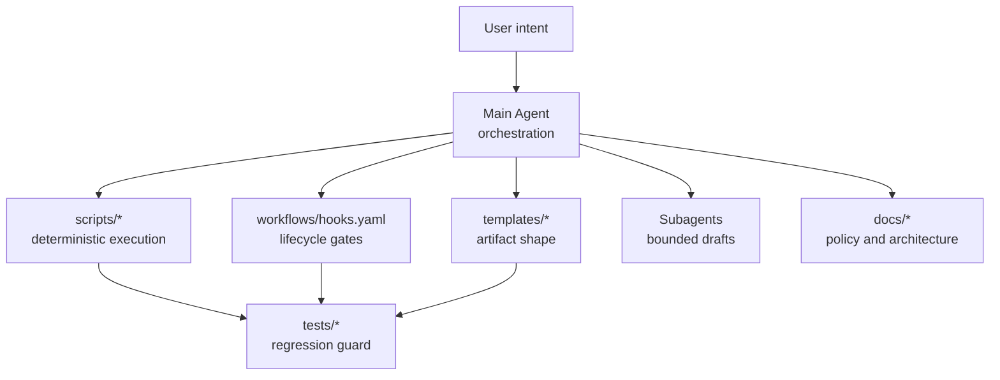

# Document Roles

이 문서는 POKit repo 안의 Markdown, YAML, template, script가 각각 어떤 책임을 갖는지 정리한다. 목표는 `AGENTS.md`를 규칙 창고로 키우지 않고, 메인 에이전트가 오케스트레이션에 집중하게 하는 것이다.

## Principle

LLM은 필요한 판단 구간에서만 개입한다. 반복 가능한 렌더링, 검증, gate, format, preflight는 scripts, hooks, templates, tests가 맡는다.

## Role Map

| Path | Role | Should Contain | Should Not Contain |
|---|---|---|---|
| `AGENTS.md` | main-agent orchestration | session bootstrap command, approval boundaries, high-signal runtime reminders, where to delegate detail | long policy explanations, artifact templates, detailed flow diagrams, duplicated canonical docs |
| `docs/OPERATING_MODEL.md` | canonical operating policy | durable rules, approval model, external write policy, 버전 스프린트 policy | historical rationale or one-off examples that belong in architecture docs |
| `docs/VERSIONING.md` | canonical version policy | SemVer rules, release states, hotfix/pre-release policy | detailed backlog or orchestration flow |
| `docs/architecture/*` | architecture and flow explanation | glossary, file roles, context flow, backlog/release diagrams, examples | executable policy that scripts should enforce directly |
| `workflows/hooks.yaml` | lifecycle gate registry | hook names, runner, enforcement metadata, gates | prose-only policy or user-facing report text |
| `workflows/agent-roles.yaml` | subagent role contract | bounded role definitions, owned artifacts, prompt templates, output schema | final product judgment or external write authority |
| `workflows/definition-pipeline.yaml` | machine-readable definition workflow | stage IDs, required artifacts, size gates, role mapping | long narrative rationale |
| `workflows/messages.yaml` | reusable user-facing fixed copy | section labels, recurring confirmation text, emoji markers | one-off conversational prose |
| `templates/definition-pipeline/` | generated artifact shape | headings, required sections, standard fields | policy decisions not backed by docs/tests |
| `scripts/*` | deterministic execution | rendering, validation, dry-run planning, guards, apply helpers | LLM judgment or hidden external writes |
| `tests/*` | regression guard | policy contracts, rendering expectations, safety boundaries | implementation rationale |
| `memory/*` | local runtime state | current context, resume brief, local pointers | public product policy or private raw data in upstream release |
| `artifacts/*` | local drafts/evidence | generated draft outputs, run summaries, retros, problem review memos | public canonical docs unless sanitized and moved to `examples/` |
| `examples/*` | public-safe samples | redacted examples and fixtures | live user memory, private workspace IDs, credentials |

## Architecture Index

- `docs/architecture/00-glossary.md`: shared terms.
- `docs/architecture/01-document-roles.md`: file and document responsibilities.
- `docs/architecture/07-backlog-intake-flow.md`: backlog creation and intake.
- `docs/architecture/08-cycle-vs-linear-cycle.md`: 위클리 서클 vs 버전 스프린트.
- `docs/architecture/09-release-and-non-release-flow.md`: release and non-release close.
- `docs/architecture/10-versioning-policy.md`: version number meaning and run choice.
- `docs/architecture/11-visualization-and-incident-response.md`: stage visualization and incident response.
- `docs/architecture/12-conversation-standards.md`: situation-based user-facing copy and visual language.
- `docs/architecture/13-backlog-title-and-outline-standards.md`: Backlog memo and Linear issue title/outline standards.
- `docs/architecture/14-linear-structure-standards.md`: Linear Cycle, POKit Circle, Parent issue, and Sub-issue structure.

## Main Agent Role

The main agent owns orchestration:

- preserve the latest user intent;
- choose which policy, hook, script, template, or subagent applies;
- keep scope and approval boundaries clear;
- integrate subagent outputs;
- interpret verification results;
- decide release vs non-release close;
- make final user-facing completion claims.

The main agent should not hand-roll work that already has a deterministic owner. If a script renders the brief, use the script output. If a template defines an artifact, use the template. If a hook defines a gate, run or emulate the hook.

## Subagent Role

Subagents produce bounded drafts or analysis. They do not make final Done claims, final safety claims, release decisions, or external write decisions.

Subagent work must name:

- owned files or responsibility;
- expected artifact;
- done gate;
- output schema;
- decisions that must return to the main agent.

## Hooks And Scripts

Hooks and scripts are the standardization layer. They keep repeated behavior stable without relying on long LLM memory.

Use them for:

- session bootstrap;
- context map validation;
- message catalog validation;
- subagent payload validation;
- public safety scan;
- release preflight;
- Linear external write preflight;
- deterministic brief rendering.
- POKit Circle / 버전 스프린트 identity rendering.

## Templates

Templates define artifact shape. The LLM fills in the judgment-sensitive content, but the section structure stays stable.

If a generated artifact needs a new recurring section, update the relevant template and test instead of adding ad hoc prose in an answer.
