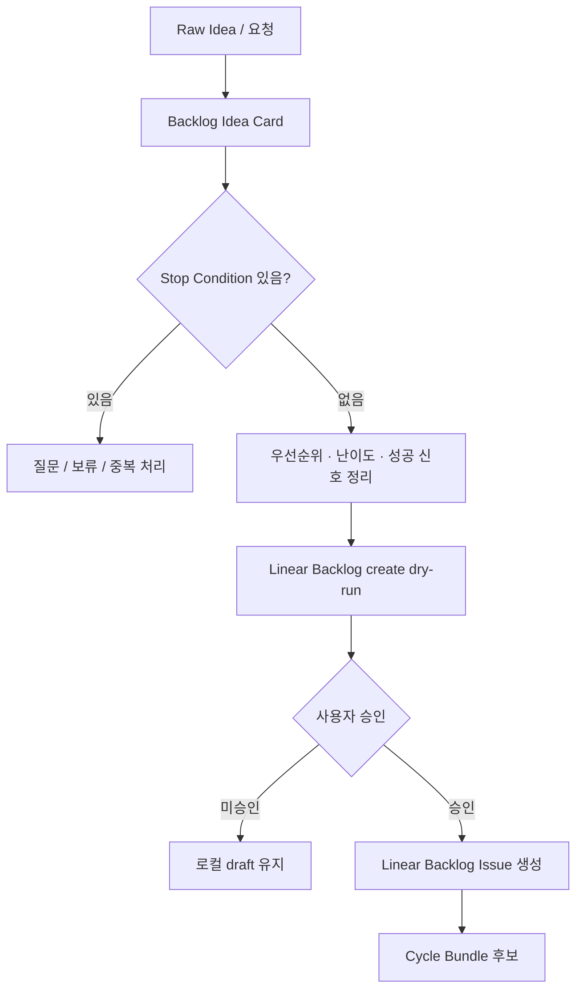

# Backlog Intake Flow

Backlog Intake는 raw idea를 바로 구현하지 않고 실행 가능한 Linear Backlog Issue 후보로 정제하는 흐름이다.

## Flow



## Input Sources

- 대화 중 나온 아이디어
- Problem/Error Review 메모
- 회고에서 나온 개선점
- 외부 signal, 뉴스, 고객 요청
- 기존 Linear Backlog
- 완료 작업 중 follow-up

## Linear Backlog Issue Rules

Linear Backlog Issue 생성 전에는 다음을 확인한다.

```text
title: 한국어 우선. release bundle 후보라면 targetVersion 포함.
description: 문제, 기대 결과, 완료 조건, source/evidence.
labels: pokit:criteria, pokit:prd, Improvement 등 실행 라우팅에 필요한 라벨.
state: Backlog 또는 Todo.
duplicate check: 기존 Linear issue와 완료 증거 확인.
idempotency key: 중복 생성 방지용 visible key.
external write: dry-run + 사용자 승인 후에만 실행.
```

제목과 목차는 `docs/architecture/13-backlog-title-and-outline-standards.md`를 따른다. 제목은 `[상태] 대상 - 해야 할 일` 형식의 한글 우선 문구로 만들고, `targetVersion`, `runId`, `releaseKind`, `source`, `labels`, `idempotencyKey` 같은 기계적 값은 Linear description 변수 영역에 분리한다.

## Stop Conditions

다음 조건이 있으면 바로 Linear 등록하지 않는다.

- 목적 불명확
- 사용자 결과 없음
- 범위 과대
- 중복 가능성
- 비용, 법적, 개인정보 위험
- 외부 write 포함
- 배포 정책이나 release scope에 영향이 있는데 targetVersion이 없음

## LLM Boundary

LLM이 필요한 구간:

- raw idea를 title, user outcome, hypothesis로 정리
- stop condition 판단
- 중복 가능성 판단
- Definition Pipeline 크기 제안
- release/non-release 후보 판단

LLM이 필요 없는 구간:

- Backlog Idea Card markdown 렌더링
- deterministic score 계산
- CREATE / SKIP / NOOP 분류
- idempotency key 표시
- dry-run ASCII 출력

## Related Files

- `scripts/backlog-idea-card.ts`
- `scripts/linear-create-preflight.ts`
- `workflows/definition-pipeline.yaml`
- `templates/definition-pipeline/`
- `tests/backlog-idea-card.test.mjs`
- `tests/linear-create-preflight.test.mjs`
