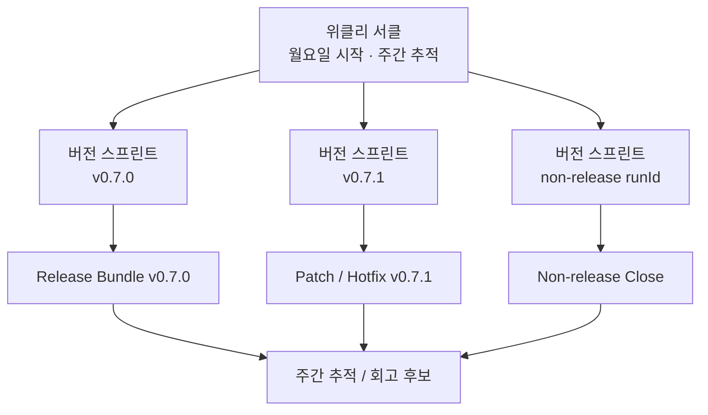

# 위클리 서클 vs 버전 스프린트

POKit은 Linear Cycle을 그대로 실행 루프로 쓰지 않는다. Linear Cycle은 주간 추적 컨테이너이고, POKit의 실제 실행 단위는 버전 스프린트이다.

## Relationship



## 위클리 서클

- 월요일 시작
- 한 주 동안의 버전 스프린트, 배포, 보류, follow-up을 추적
- 주간 회고의 기준 단위
- 실행 루프가 아니라 planning/tracking/review 컨테이너

## 버전 스프린트

- `targetVersion` 또는 `runId`를 기준으로 실행
- 하루에 여러 번 돌 수도 있고, 며칠 걸릴 수도 있음
- Backlog 선정, 구현/문서, 검증, release/non-release 판단, close를 포함
- public release로 나가면 Release Bundle을 가진다

POKit Circle은 사용자-facing 별칭으로 쓸 수 있지만, 추적 단위는 버전 스프린트과 같다. 제목만으로 추적하지 않는다.

```text
title = 사람이 목록에서 읽는 표시
pokitRunId = POKit Circle / 버전 스프린트의 안정 식별자
linearCycleId = 위클리 서클 연결
cycleBundleId = 이번 실행에 묶인 issue bundle
targetVersion 또는 runId = release/non-release 구분
```

예시:

```yaml
title: "[포킷서클 v0.8.0] Backlog 표준화 - 적용"
pokitRunId: "pokit:run:release:v0.8.0"
pokitRunKind: "release"
linearCycleId: "linear-cycle-2026-w21"
linearCycleName: "2026-W21"
cycleBundleId: "bundle-backlog-standard"
targetVersion: "v0.8.0"
runId: "none"
issueIds:
  - POKIT-101
  - POKIT-102
```

## Cycle Bundle

Cycle Bundle은 버전 스프린트 안에서 처리할 이슈 묶음이다. 위클리 서클에 배치될 수 있지만 같은 개념이 아니다.

```text
위클리 서클 = 주간 관찰판
버전 스프린트 = 실제 실행 단위
Cycle Bundle = 버전 스프린트에서 처리할 이슈 묶음
Release Bundle = 배포 버전 묶음
```

## Policy

- 새 durable work는 Linear Backlog Issue에서 시작한다.
- 구현은 버전 스프린트 또는 승인된 Cycle Bundle 안에서만 진행한다.
- 위클리 서클은 추적과 회고 기준으로 유지한다.
- public release가 필요한 버전 스프린트은 release gate 전까지 complete로 보지 않는다.
