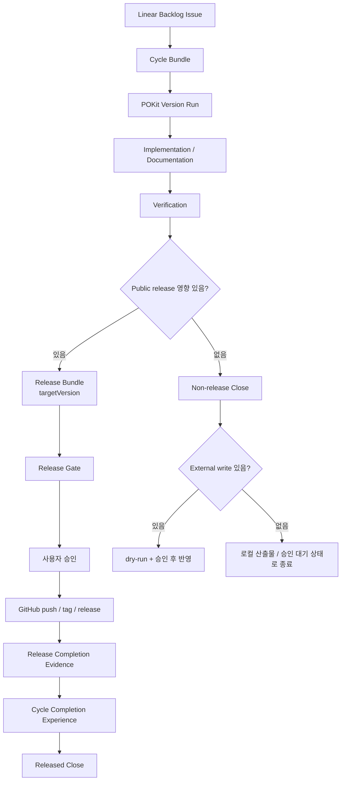

# Release And Non-release Flow

Version Run의 결과는 Release Bundle 또는 Non-release Close로 나뉜다. 모든 작업이 GitHub release로 가는 것은 아니지만, public release가 필요한 작업은 release gate를 생략할 수 없다.

## Flow



## Release Bundle

Release Bundle은 public release로 나갈 변경 묶음이다. 다음을 가져야 한다.

- `targetVersion`
- 포함 이슈 목록
- release scope
- CHANGELOG 후보
- release gate 상태
- public safety scan 결과
- 사용자 승인 경계

## Release Gate

Release gate는 최소 다음을 확인한다.

- target version이 `docs/VERSIONING.md` 기준에 맞음
- `CHANGELOG.md`에 해당 scope가 반영됨
- public safety scan 통과
- release markdown audit 통과
- release preflight 통과
- `memory/`, private artifacts, credentials가 public release에 포함되지 않음
- GitHub push, tag, release 각각 사용자 승인 필요

## Release Completion Evidence

GitHub push/tag/release가 끝나면 release gate 통과만으로 close하지 않는다. 배포 완료 evidence를 생성하고, 그 evidence가 Cycle Completion Experience를 트리거해야 한다.

표준 evidence:

```md
## Release Completion Evidence

targetVersion: v0.7.0
commit: a1a988b
tag: v0.7.0
branch: main
remote: origin
releaseUrl: https://github.com/dongwonlee222/POKit/releases/tag/v0.7.0
release preflight: passed
GitHub push/tag/release: completed

## Cycle Completion Experience Trigger

celebrationTrigger: ready
reason: release gate completed and public release boundary was applied.
```

정본 renderer:

- `scripts/release-preflight.ts#renderReleaseCompletionEvidence`
- `tests/release-preflight.test.mjs`

이 evidence가 없으면 배포 명령이 성공해도 POKit close renderer는 release complete로 판단하지 못할 수 있다.

## Non-release Work

Non-release Work는 public release 없이 닫는 작업이다.

예시:

- 로컬 초안 문서
- 승인 받을 문서 작업
- private artifact
- Linear 정리만 하는 작업
- git에 올리지 않는 조사/분석 파일
- 외부 제출 전 내부 검토 자료

Non-release Close는 다음을 남긴다.

- 산출물 저장 위치
- 사용자 승인 대기 여부
- Linear/GitHub 등 external write 여부
- git에 올리지 않는 이유
- 다음 액션

## Rule

```text
Cycle Bundle은 실행 묶음이다.
Release Bundle은 배포 묶음이다.
Non-release Work는 배포 없이도 Version Run 안에서 완료될 수 있다.
```
