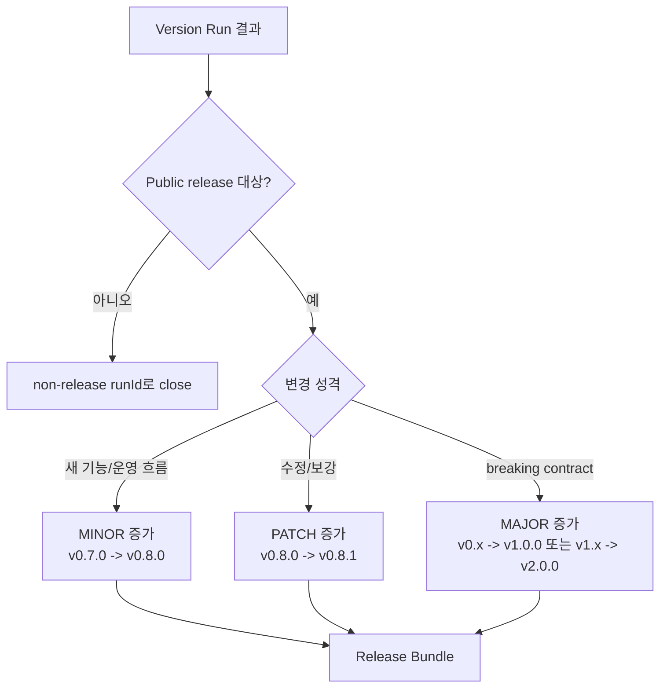

# Versioning Policy

POKit Version Run은 public release로 나갈 때 SemVer `targetVersion`을 가진다. 배포와 무관한 실행은 SemVer를 올리지 않고 명시적 `runId`로 닫는다.

Canonical release policy는 `docs/VERSIONING.md`에 둔다. 이 문서는 아키텍처 관점의 예시와 판단 흐름을 설명한다.

## Format

```text
vMAJOR.MINOR.PATCH
예: v0.8.1
```

## Number Meaning

```text
MAJOR
- 제품/운영 계약이 크게 바뀜
- 기존 사용법, 문서 구조, 자동화 흐름이 깨질 수 있음
- 예: v1.0.0

MINOR
- 새로운 기능 흐름, 운영 체계, 큰 문서/스크립트 단위 추가
- 기존 사용자는 대체로 이어서 쓸 수 있음
- 예: v0.8.0

PATCH
- 버그 수정, 문서 보강, 안전장치, 작은 UX 개선
- 기존 흐름을 바꾸지 않음
- 예: v0.8.1
```

## Early Version Rules

```text
v0.x.y
- 아직 1.0 전
- 운영 모델이 계속 변할 수 있음
- MINOR가 큰 운영 변화까지 포함할 수 있음

v0.7.0
- 0.7 계열의 기준 release
- 특정 운영 주제나 기능 묶음이 들어감

v0.7.1
- 0.7.0 이후의 보정, 문서, 버그 수정

v0.8.0
- 0.8 계열의 새 기능/정책 묶음

v0.0.1
- bootstrap/test release에만 사용
- 현재 POKit 운영 release에는 되도록 사용하지 않음

v1.0.0
- 핵심 운영 루프가 안정됨
- Backlog -> Version Run -> Release/Non-release 흐름이 고정됨
- 외부 사용자가 따라 해도 큰 혼란이 없는 상태
```

## Choice Flow



## Pre-release

```text
v0.8.0-alpha.1
- 실험적

v0.8.0-beta.1
- 기능은 거의 있지만 검증 전

v0.8.0-rc.1
- 정식 release 후보
```

RC tag는 최종 release tag가 아니다. 승인 후 clean stable tag로 승격한다.

## Non-release Runs

Non-release Run은 public release가 없으므로 SemVer를 올리지 않는다.

예시:

```text
docs-review-2026-05-16
approval-pack-v0.8-prep
linear-cleanup-2026-W21
```

Non-release Run도 산출물 위치, 승인 대기 여부, 외부 write 여부, close 이유를 남긴다.

## Run Identity

POKit Circle / Version Run은 제목이 아니라 안정 식별자로 추적한다.

```text
release run:     pokit:run:release:<targetVersion>
non-release run: pokit:run:non-release:<runId>
hotfix run:      pokit:run:hotfix:<targetVersion>:source=<sourceCycle>:resume=<resumeCycle>
```

정본 구현:

- `scripts/pokit-run-identity.ts`
- `tests/pokit-run-identity.test.mjs`

제목은 사람이 읽는 표시이므로 바뀔 수 있다. `pokitRunId`, `targetVersion`, `runId`, `sourceCycle`, `resumeCycle`, `cycleBundleId`, `linearCycleId`가 추적 기준이다.
