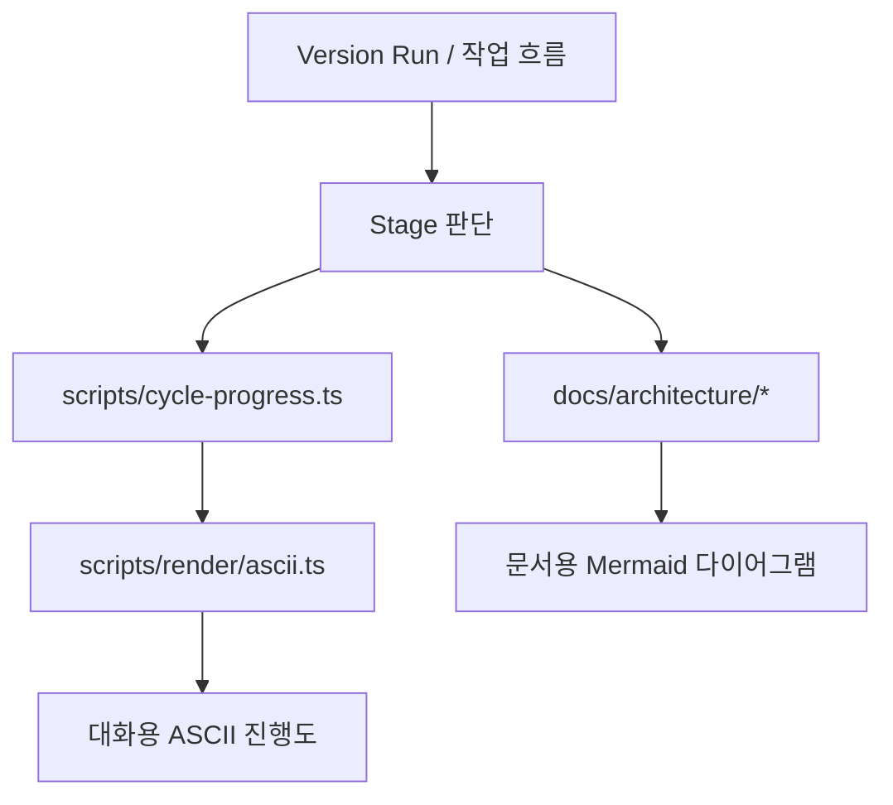
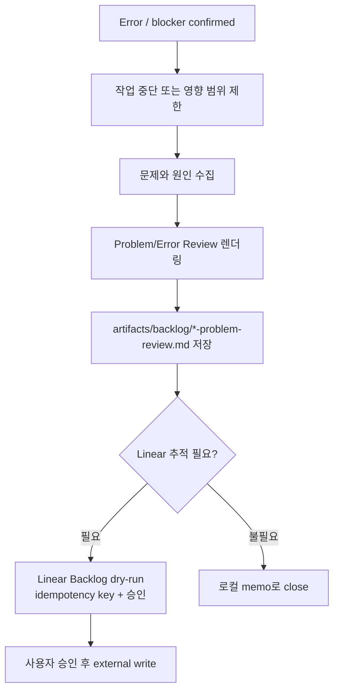

# Stage Visualization And Incident Response

이 문서는 POKit의 단계별 시각화와 에러/장애 대응 흐름을 한 곳에 모은다. 상세 정책은 `docs/OPERATING_MODEL.md`에 있고, 실제 렌더링은 scripts가 맡는다.

## Stage Visualization

POKit은 진행 상태를 LLM이 임의 문장으로 설명하지 않고, 정해진 visual pattern으로 보여준다.



## Live Conversation Visuals

대화와 brief 출력에는 ASCII를 쓴다.

대표 패턴:

```text
POKit 진행도
[████░░░░░░] 4/10 · 현재: 작업 Gate 확인

1. 시작 브리프        ✅
2. Cycle 기준 확인    ✅
3. Issue 묶음 확인    ✅
4. 작업 Gate 확인     ▶ 진행 중
5. 로컬 구현/문서     ⏳
6. 테스트/검증        ⏳
7. 완료 증거 정리     ⏳
8. 외부 write dry-run ⏳
9. 사용자 승인        ⏳
10. 외부 반영/close   ⏳
```

정의 위치:

- policy: `docs/OPERATING_MODEL.md#cycle-step-progress-contract`
- renderer: `scripts/cycle-progress.ts`
- primitive renderer: `scripts/render/ascii.ts`
- usage: `scripts/session-brief.ts`, `scripts/session-close.ts`
- tests: `tests/session-start.test.mjs`, `tests/session-close.test.mjs`, `tests/ascii-renderer.test.mjs`

## External Write Preflight Visuals

Linear/GitHub처럼 외부 상태를 바꾸기 직전에는 일반 설명문이 아니라 표준 preflight status block을 먼저 보여준다.

```text
Linear Backlog 등록 사전 확인
[████████░░] 80%

✅ 로컬 Problem/Error Review 메모 생성 완료
✅ Linear issue 생성 payload 준비 완료
✅ idempotency key 확인 완료
⏳ 실제 Linear write는 승인 대기
```

정의 위치:

- renderer: `scripts/render/ascii.ts`의 `renderPreflightStatusBlock`
- Linear backlog create usage: `scripts/linear-create-preflight.ts`
- policy: `docs/OPERATING_MODEL.md#external-write-confirmation-contract`
- tests: `tests/ascii-renderer.test.mjs`, `tests/linear-create-preflight.test.mjs`

이 블록은 LLM 문장 생성 대상이 아니다. LLM은 어떤 항목이 완료/대기/차단인지 판단하고, 렌더링은 renderer가 맡는다.

## A/B Choice Visuals

A/B 선택지는 실제 결정이 필요할 때만 나온다.

나오는 경우:

- Linear/GitHub 외부 write 승인
- 제품 판단이 필요한 선택
- destructive action 또는 되돌리기 어려운 변경
- scope가 애매해서 POKit이 임의로 확정하면 안 되는 경우

나오지 않는 경우:

- 이미 승인된 Cycle intent 안의 기계적 하위 단계
- 로컬 파일 편집, 테스트, local draft artifact 생성
- 단순 상태 조회 또는 brief 출력

정의 위치:

- policy: `docs/OPERATING_MODEL.md#external-write-confirmation-contract`
- message labels: `workflows/messages.yaml`의 `external_write.*`
- renderer: `scripts/render/ascii.ts`의 `renderDecisionChoiceBlock`
- existing usage: `scripts/session-close.ts`, `scripts/cycle-close.ts`

기존 일부 script는 A/B 문구를 직접 조립하고 있다. 새 구현은 `renderDecisionChoiceBlock`을 우선 사용해야 하며, 직접 조립은 점진적으로 제거한다.

## Durable Documentation Visuals

아키텍처, 흐름, decision map처럼 오래 남는 설명에는 Mermaid를 쓴다.

```text
Mermaid = docs/architecture, docs/OPERATING_MODEL, roadmap-level diagrams
ASCII = live conversation, brief output, dry-run, failure/progress status
```

## Incident Response

에러, 장애, 잘못된 가정, 실패한 외부 호출, 실패한 테스트, 잘못된 assistant behavior가 확인되면 `on_error` 흐름을 따른다.



정의 위치:

- hook: `workflows/hooks.yaml`의 `on_error`
- user-facing renderer: `scripts/problem-error-review.ts`
- runner: `scripts/hooks-runner.ts`
- memo path: `artifacts/backlog/[short-kebab-problem]-problem-review.md`
- policy: `docs/OPERATING_MODEL.md#problemerror-review-memo-contract`
- tests: `tests/problem-error-review.test.mjs`, `tests/hooks-runner.test.mjs`, `tests/hooks-contract.test.mjs`

## Problem/Error Review Format

```text
# 🚨 Problem / Error Review: [짧은 제목]

진행 상황
[███░░] 3/5

## 1️⃣ 무엇이 문제인가?
## 2️⃣ 언제 / 누구로 인하여 / 왜 발생했나?
## 3️⃣ 근본 해결 방법 제안
## 다음 조치
```

## Response Rules

- `🚨` and `⚠️` are reserved for errors and risks, not normal long-session nudges.
- A confirmed blocker must leave a local Problem/Error Review memo before closing.
- If the problem should become official Linear work, create a separate Linear Backlog dry-run after the local memo.
- External write still requires dry-run, user approval, and idempotency key.
- Do not hide failed or skipped work in a success summary.

## LLM Boundary

LLM이 필요한 구간:

- 장애가 실제 blocker인지 판단
- 원인과 예방책을 설명
- Linear 추적 필요 여부 판단
- 다음 조치 우선순위 제안

LLM이 필요 없는 구간:

- progress bar 렌더링
- preflight status block 렌더링
- A/B choice block 렌더링
- Problem/Error Review heading format
- memo path 생성
- hook registry 조회
- on_error runner 실행

## Context Dilution Risk

컨텍스트 희석에 민감한 구간:

- “지금 A/B 선택지를 보여줘야 하는가?” 판단
- 외부 write인지, 로컬 작업인지 구분
- 완료/대기/차단 상태 판정

컨텍스트 희석에 민감하지 않아야 하는 구간:

- emoji와 ASCII 형식
- progress bar 폭과 퍼센트 표기
- A/B 선택지 제목과 마지막 안내문
- idempotency key 표시 위치

따라서 형식은 `scripts/render/ascii.ts`와 테스트에 고정하고, session resume/compact 후에는 `scripts/session-start.ts`의 `orchestrator=loaded` 확인으로 이 문서를 다시 로드 가능한 상태로 유지한다.
