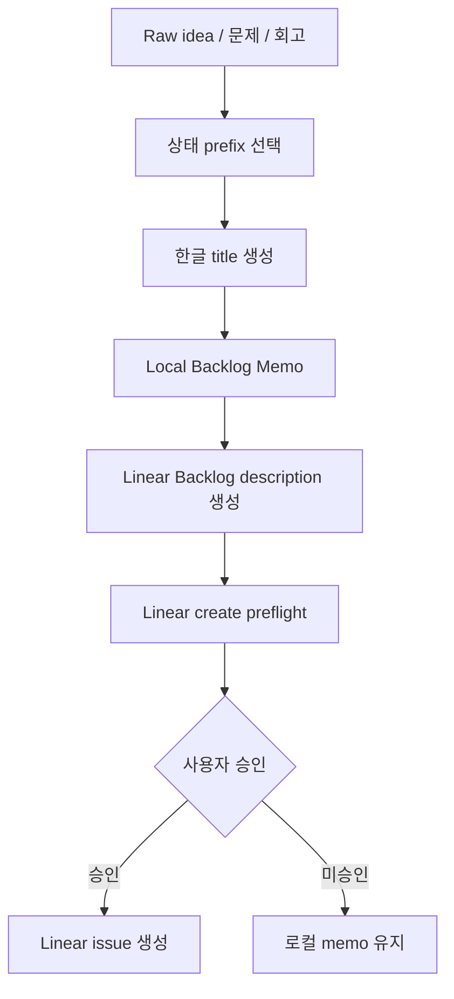

# Backlog Title And Outline Standards

이 문서는 Backlog 메모와 Linear Backlog issue의 제목, 목차, 변수 사용 규칙을 표준화한다. 목표는 제목만 봐도 사람이 현재 상태를 이해하고, LLM은 최소한의 판단만 하게 만드는 것이다.

## Core Rule

```text
한글 제목 = 사람이 Linear 목록에서 빠르게 읽는 용도
Linear 변수 = AI와 script가 판단하는 용도
Labels = routing 용도
Description 목차 = LLM 해석 최소화
Idempotency key = 외부 write 중복 방지
```

제목은 한글 우선이다. `targetVersion`, `runId`, `releaseKind`, `source`, `labels` 같은 기계적 값은 제목에 과하게 넣지 않고 Linear 변수 영역에 분리한다.

## Title Format

```text
[상태] 대상 - 해야 할 일
```

상태 prefix:

| Status | Prefix | When |
|---|---|---|
| `definition_needed` | `[정의필요]` | 목적, 범위, 완료 조건이 부족함 |
| `ready` | `[준비완료]` | 바로 Cycle Bundle 후보로 검토 가능 |
| `approval_pending` | `[승인대기]` | 외부 write 또는 제품 판단 대기 |
| `release_bound` | `[배포대상 vX.Y.Z]` | public release targetVersion이 있음 |
| `non_release` | `[비배포]` | 문서, 로컬 초안, 승인 pack처럼 release와 무관 |
| `incident_follow_up` | `[장애후속]` | Problem/Error Review에서 나온 후속 작업 |

예시:

```text
[정의필요] Backlog 제목/목차 - 표준화
[준비완료] Linear Backlog 생성 preflight - 렌더러 연결
[승인대기] Problem Review 후속 - Backlog 등록
[배포대상 v0.8.0] 세션 시작 브리프 - 최적화
[비배포] 문서 목차 - 정리
[장애후속] context 희석 후 문구 표준 - 누락 방지
```

## Local Backlog Memo Outline

Local memo는 외부 write 전 사전 확인 문서다. Linear issue description과 다르게, “무엇을 제안했고 아직 무엇을 바꾸지 않았는지”를 먼저 보여준다.

```md
# Backlog Memo: [상태] 대상 - 해야 할 일

## 요약
## 출처
## 제안 Linear 형태
## 바꾸지 않을 것
## idempotency key
```

정본 renderer:

- `scripts/backlog-outline.ts#renderLocalBacklogMemo`
- test: `tests/backlog-outline.test.mjs`

## Linear Backlog Issue Outline

Linear description은 실행 판단에 필요한 변수와 완료 조건을 고정 순서로 담는다.

```md
## 목적
## 사용자에게 보이는 변화
## 완료 조건
## 범위
## 제외 범위
## 증거 / 출처
## 배포 여부
## AS-IS (문제 정의)
## TO-BE (해결)
## 성공 검증
## 담당 에이전트
## Linear 변수
## idempotency key
```

`AS-IS / TO-BE / 성공 검증`은 v0.15.1부터 필수다. 도입 계기는 v0.14.0 Memory MVP 3건이 스키마·템플릿만 만들고 wiring 0건으로 닫힌 사례 (실효성 0). 기존 섹션과 의미가 겹쳐도 **세 섹션은 항상 명시**한다.

`담당 에이전트`는 설계 완료 시점부터 단계별로 갱신한다.

```md
## 담당 에이전트
- 설계: <모델 ID> (예: claude-opus-4-7, claude-sonnet-4-6)
- 구현: <모델 ID>
- 검수: <모델 ID>
- 타임라인: <ISO 날짜 또는 cycle id>
```

모호한 표기(`Claude`, `Codex`) 금지. 정확한 모델 ID로 책임 경로를 박제한다.

정본 renderer:

- `scripts/backlog-outline.ts#renderLinearBacklogDescription`
- test: `tests/backlog-outline.test.mjs`

## Linear Variables

다음 값은 제목에 임의로 섞지 않는다. description의 `Linear 변수` 또는 `배포 여부` 섹션에 둔다.

```yaml
state: Backlog
labels:
  - pokit:criteria
  - type:standardization
source: chat | problem_review | retro | signal | linear
releaseKind: normal | hotfix | none
targetVersion: v0.8.0 | none
runId: vr-YYYY-MM-DD-topic | none
idempotencyKey: linear:create_issue:<stable-key>
```

POKit Circle / 버전 스프린트 연결이 있는 Backlog는 다음 변수도 포함한다.

```yaml
pokitRunId: pokit:run:release:v0.8.0
pokitRunKind: release | non_release | hotfix
linearCycleId: <Linear cycle id>
linearCycleName: 2026-W21
cycleBundleId: bundle-<topic>
issueIds:
  - POKIT-101
```

이 값들은 제목으로 추적하지 않는다. 제목은 사람이 상태를 빠르게 보는 표시이고, 실제 연결은 `scripts/pokit-run-identity.ts`의 run identity 규칙을 따른다.

## Flow



## LLM Boundary

LLM이 판단할 것:

- status prefix 선택
- scope와 action 요약
- release_bound인지 non_release인지 판단
- 완료 조건과 제외 범위의 실제 내용 작성

LLM이 판단하지 말아야 할 것:

- 제목 format
- description heading 순서
- idempotency key 표시 위치
- `state`, `labels`, `source`, `releaseKind`, `targetVersion`, `runId` 필드 이름

반복 형식은 `scripts/backlog-outline.ts`가 렌더링하고, `tests/backlog-outline.test.mjs`가 고정한다.
