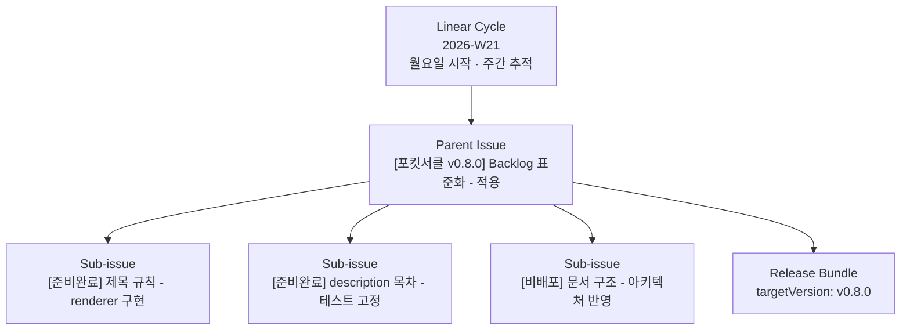
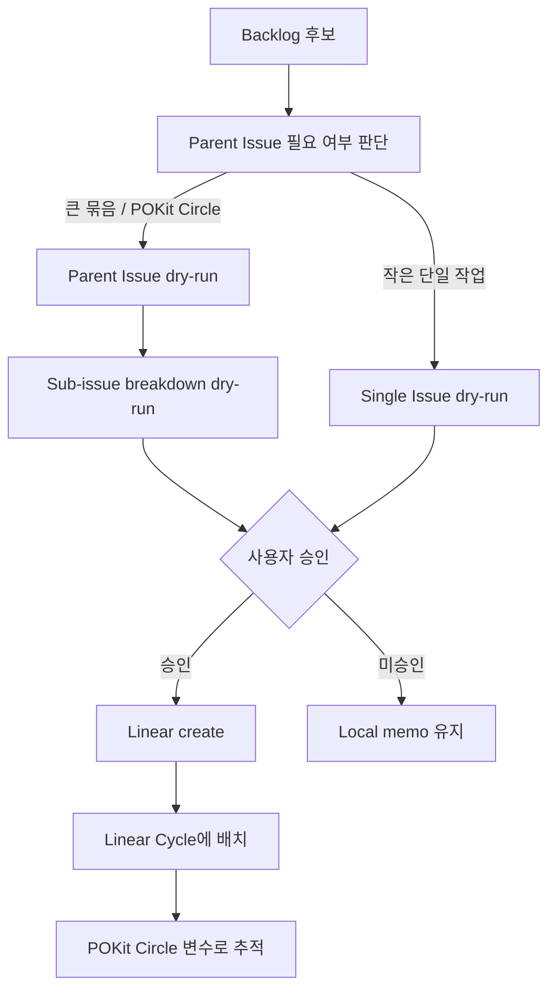

# Linear Structure Standards

이 문서는 Linear에서 POKit 작업이 어떻게 보이는지 표준화한다. 목표는 Linear Cycle, POKit Circle, Parent issue, Sub-issue가 서로 섞이지 않게 하는 것이다.

## Summary

```text
Linear Cycle = 주간 추적 컨테이너
POKit Circle = POKit Version Run의 사용자-facing 이름
Parent Issue = 하나의 POKit Circle 또는 큰 Backlog 묶음을 대표
Sub-issue = 실제 구현/문서/검증 단위
Labels = routing과 타입 분류
Description variables = AI/script 추적 기준
```

제목은 사람이 보기 위한 표시다. 추적은 `pokitRunId`, `linearCycleId`, `cycleBundleId`, `targetVersion/runId`, `parentIssueId`, `subIssueIds`로 한다.

## Linear에서 보이는 구조



Linear 화면에서는 다음처럼 보이게 한다.

```text
Cycle: 2026-W21

Parent issue:
  [포킷서클 v0.8.0] Backlog 표준화 - 적용

Sub-issues:
  [준비완료] 제목 규칙 - renderer 구현
  [준비완료] description 목차 - 테스트 고정
  [비배포] 문서 구조 - 아키텍처 반영
```

## Object Definitions

| Object | Linear 위치 | 역할 | 안정 식별자 |
|---|---|---|---|
| Linear Cycle | Linear native Cycle | 주간 tracking/review container | `linearCycleId` |
| POKit Circle | Parent issue 또는 description metadata | Version Run 사용자-facing 이름 | `pokitRunId` |
| Cycle Bundle | Parent issue description metadata | 이번 실행에 묶인 issue set | `cycleBundleId` |
| Parent Issue | Linear issue | POKit Circle 또는 큰 backlog 묶음 대표 | `parentIssueId` |
| Sub-issue | Linear sub-issue | 실제 구현/문서/검증 단위 | `subIssueIds[]` |
| Release Bundle | description metadata / release artifact | public release 묶음 | `targetVersion` |
| Non-release Close | description metadata / local artifact | public release 없이 닫는 실행 | `runId` |

## Parent Issue

Parent issue는 POKit Circle 또는 큰 backlog 묶음을 대표한다.

제목:

```text
[포킷서클 v0.8.0] Backlog 표준화 - 적용
[포킷서클 비배포] 문서 정리 - 승인 pack 생성
[포킷서클 Hotfix v0.8.1] release 누락 - 보정
```

Description에 반드시 들어가는 변수:

```yaml
pokitRunId: pokit:run:release:v0.8.0
pokitRunKind: release
linearCycleId: <Linear cycle id>
linearCycleName: 2026-W21
cycleBundleId: bundle-backlog-standard
targetVersion: v0.8.0
runId: none
parentIssueId: POKIT-101
subIssueIds:
  - POKIT-102
  - POKIT-103
releaseKind: normal
```

## Sub-issue

Sub-issue는 실제 실행 단위다. 제목은 `docs/architecture/13-backlog-title-and-outline-standards.md`의 `[상태] 대상 - 해야 할 일` 규칙을 따른다.

예시:

```text
[준비완료] 제목 규칙 - renderer 구현
[준비완료] description 목차 - 테스트 고정
[비배포] 문서 구조 - 아키텍처 반영
[승인대기] Linear issue 생성 - 외부 write 대기
```

Sub-issue description 변수:

```yaml
parentIssueId: POKIT-101
pokitRunId: pokit:run:release:v0.8.0
cycleBundleId: bundle-backlog-standard
artifactPath: scripts/backlog-outline.ts
doneGate: tests/backlog-outline.test.mjs
externalWrite: none | linear_update | github_release
```

## Sub-issue Task Checklist

Sub-issue 아래의 세부 작업은 기본적으로 Linear issue를 더 만들지 않고 Sub-issue description 안의 checklist로 관리한다.

```md
## Task Checklist

subIssueId: POKIT-102

- [ ] task:renderer · renderer 함수 추가 · doneGate: scripts/backlog-outline.ts
- [ ] task:test · 회귀 테스트 추가 · doneGate: tests/backlog-outline.test.mjs
- [ ] task:docs · 문서 반영 · doneGate: docs/architecture/14-linear-structure-standards.md
```

기준:

- 작고 같은 완료 조건 안에 있으면 checklist로 둔다.
- 독립적으로 완료/검증/담당 가능하면 별도 Sub-issue로 승격한다.
- 별도 승인, 별도 release gate, 별도 산출물이 있으면 별도 Sub-issue로 승격한다.
- Sub-issue 아래 sub-sub-issue는 기본적으로 만들지 않는다.

정본 renderer:

- `scripts/backlog-outline.ts#renderSubIssueTaskChecklist`
- `tests/backlog-outline.test.mjs`

## Labels

라벨은 제목 대신 routing에 쓴다.

```yaml
pokit:prd
pokit:criteria
type:standardization
type:problem-follow-up
release:normal
release:hotfix
release:none
run:parent
run:subtask
```

## Creation Flow



## What Not To Do

- Linear Cycle 이름만으로 POKit Circle을 추적하지 않는다.
- Parent issue 제목만으로 release/non-release를 판단하지 않는다.
- Sub-issue 제목에 모든 변수를 밀어 넣지 않는다.
- `targetVersion`, `runId`, `cycleBundleId`, `parentIssueId`를 description에서 생략하지 않는다.
- Linear Cycle을 실행 완료 기준으로 보지 않는다. 완료 기준은 POKit Circle / Version Run close다.

## Context Minimization

LLM이 판단할 것:

- Parent issue가 필요한지
- Sub-issue로 쪼갤지
- release/non-release/hotfix 종류
- 각 issue의 실제 완료 조건

LLM이 판단하지 말아야 할 것:

- Linear 계층 이름
- 필수 변수 이름
- Parent/Sub description 변수 위치
- POKit Circle run id format

정본 구현과 테스트:

- `scripts/pokit-run-identity.ts`
- `scripts/backlog-outline.ts`
- `tests/pokit-run-identity.test.mjs`
- `tests/backlog-outline.test.mjs`
